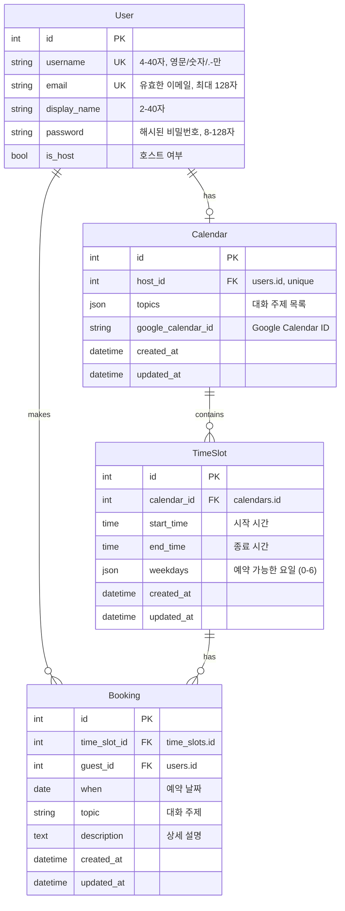
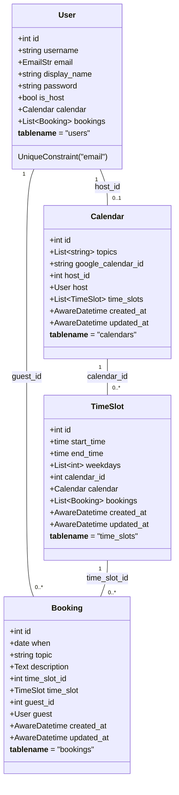
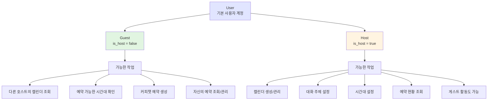
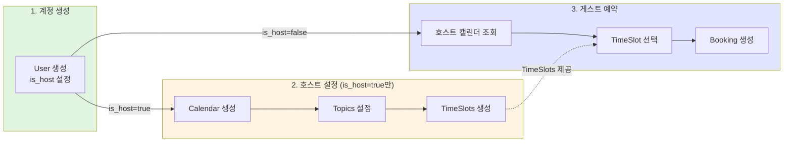
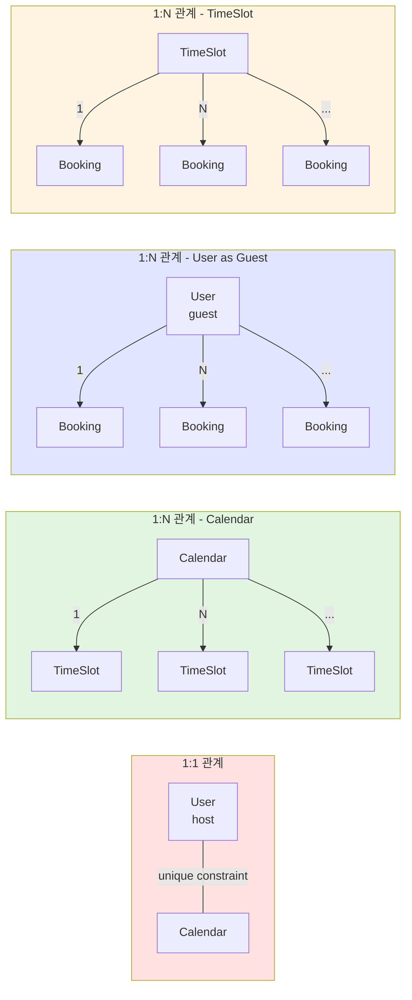
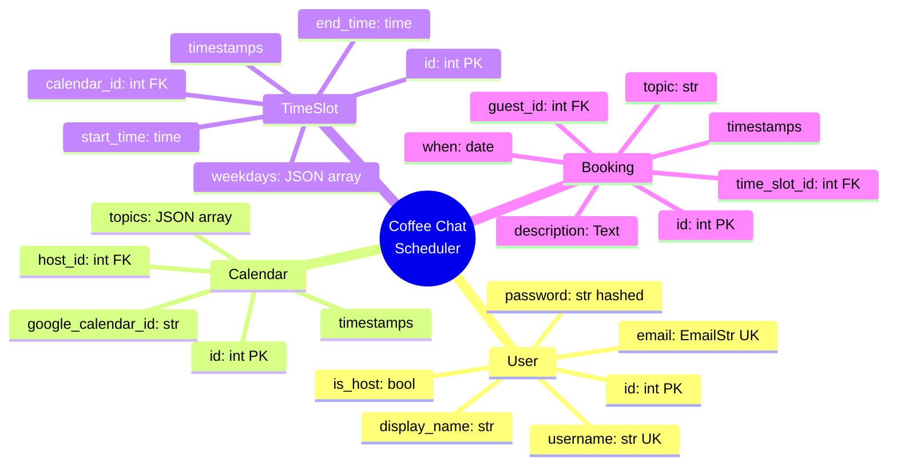

# Data Model Diagrams

## 1. Entity Relationship Diagram (ERD)

---

## 2. Database Schema (Detailed)

---

## 3. User Type Hierarchy

---

## 4. Data Flow - Account Creation to Booking

---

## 5. Relationship Cardinality

---

## 6. Field Type Overview

---

## 다이어그램 설명

1. **ERD**: 테이블 간 관계와 주요 필드 표시
2. **Database Schema**: 클래스 다이어그램 형식으로 상세 필드 및 관계 표현
3. **User Type Hierarchy**: 게스트와 호스트의 차이점 및 가능한 작업
4. **Data Flow**: 계정 생성부터 예약까지의 데이터 흐름
5. **Relationship Cardinality**: 각 관계의 카디널리티(1:1, 1:N) 설명
6. **Field Type Overview**: 마인드맵 형식으로 전체 데이터 구조 개요

