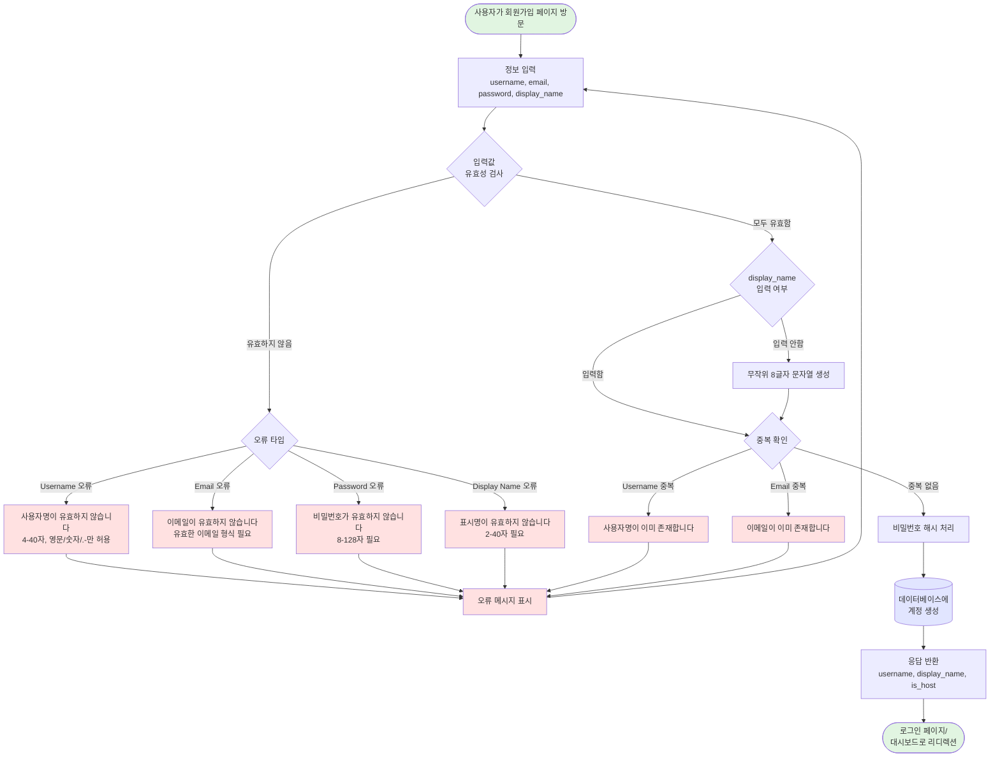
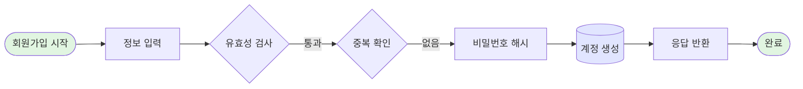
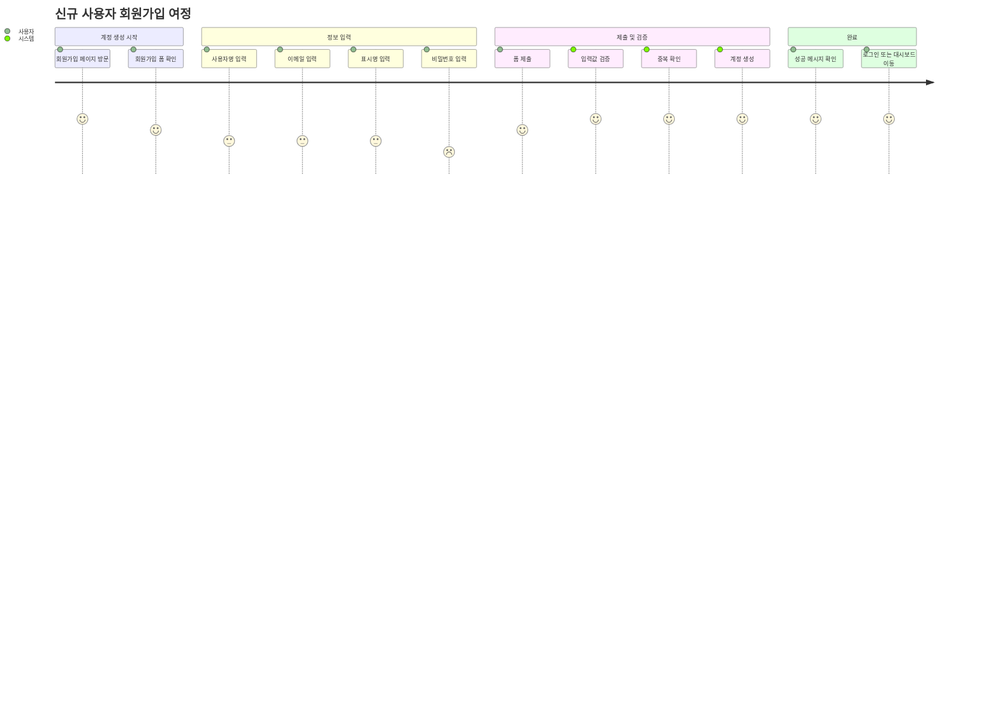
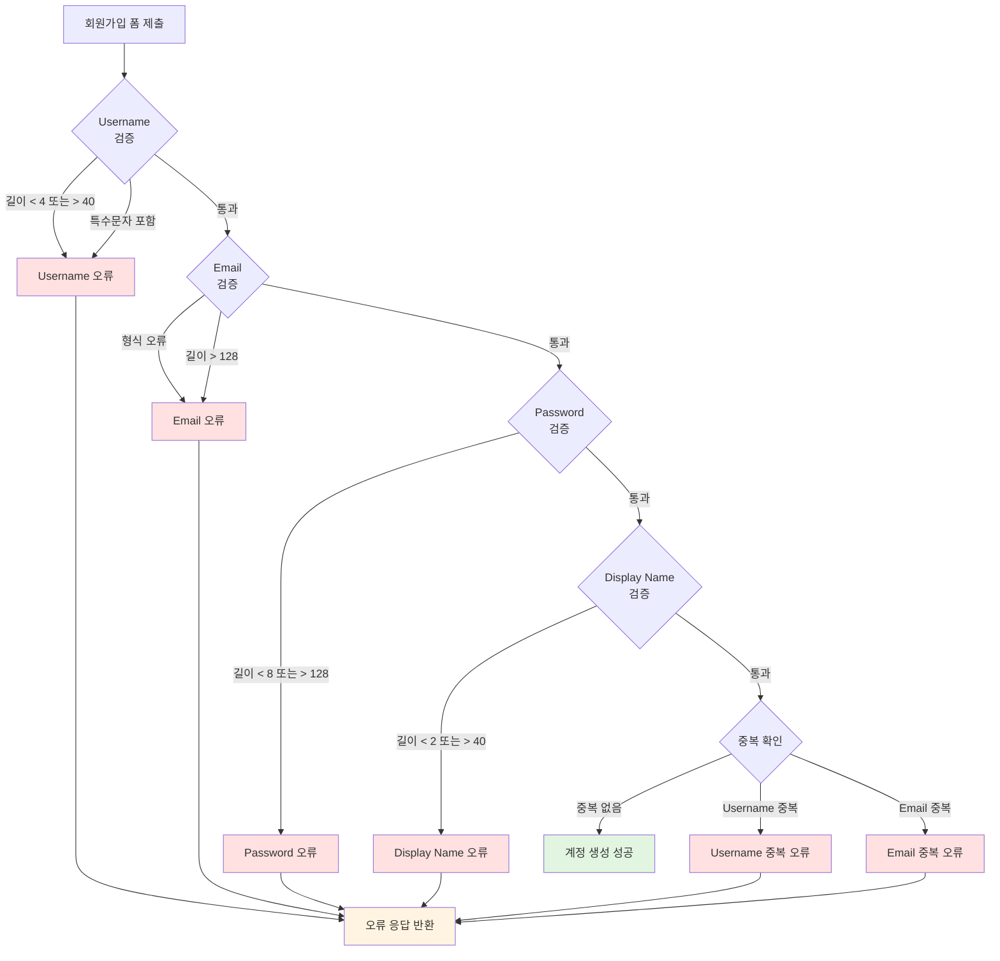
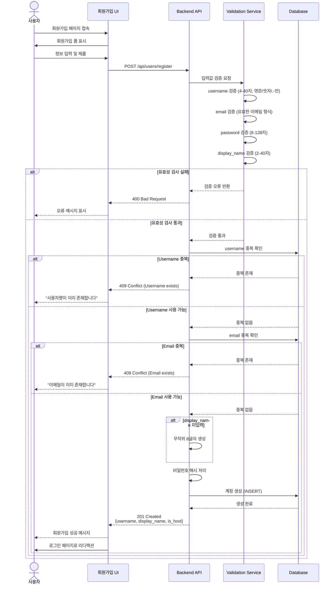
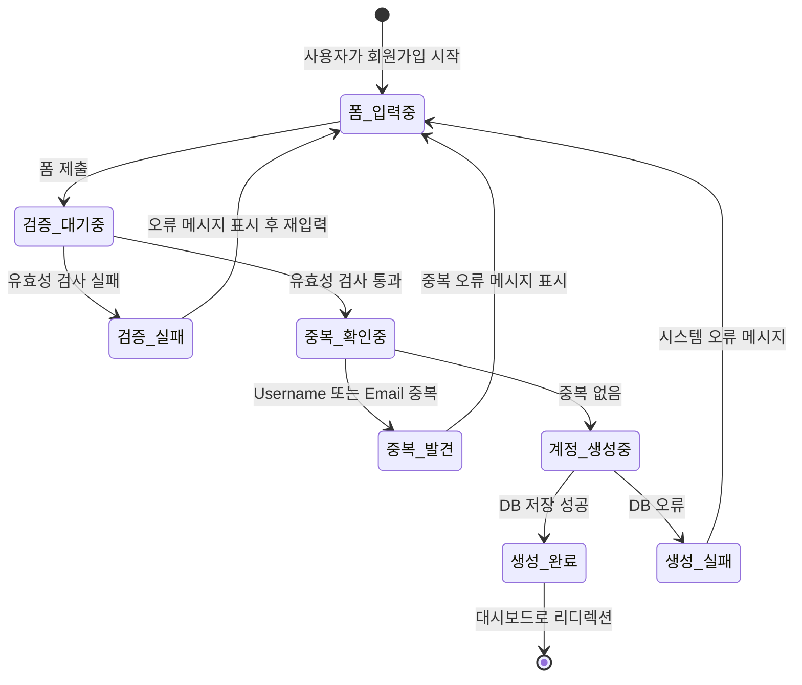

# User Flow Diagrams - Account Registration

## 1. Successful Registration Flow (Happy Path)

---

## 2. Simplified Happy Path Only

---

## 3. User Journey - Registration Process

---

## 4. Error Handling Flow

---

## 5. Sequence Diagram - User Registration

---

## 6. State Diagram - Account Status

---

## 다이어그램 설명

1. **Successful Registration Flow**: 전체 회원가입 프로세스 (성공 및 오류 경로 포함)
2. **Simplified Happy Path**: 성공 경로만 간단히 표현
3. **User Journey**: 사용자 관점에서의 회원가입 경험 여정
4. **Error Handling Flow**: 각 검증 단계별 오류 처리 흐름
5. **Sequence Diagram**: 시스템 컴포넌트 간 상호작용 순서
6. **State Diagram**: 계정 생성 프로세스의 상태 전환

