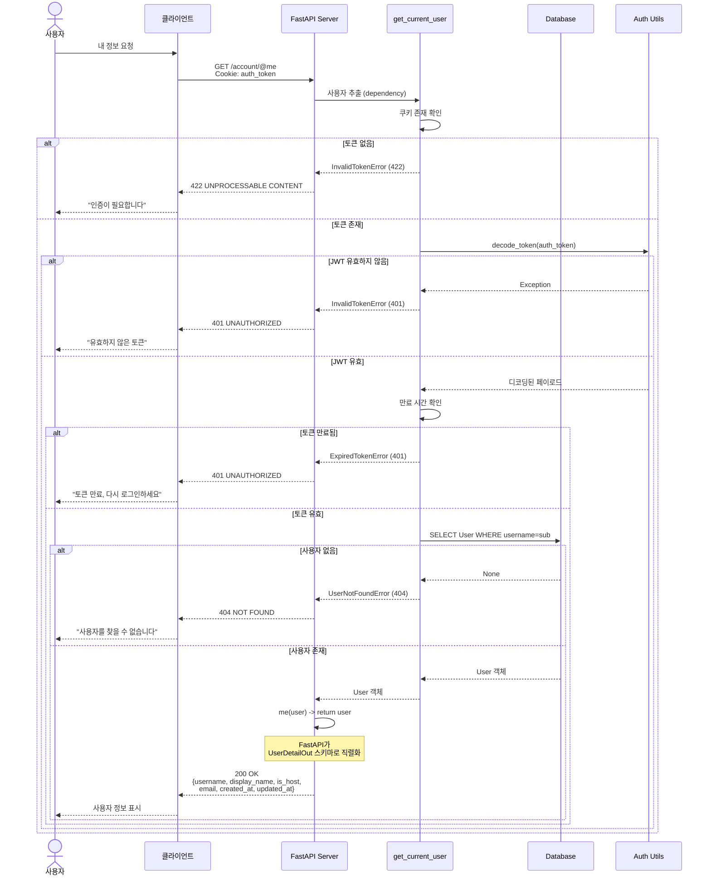
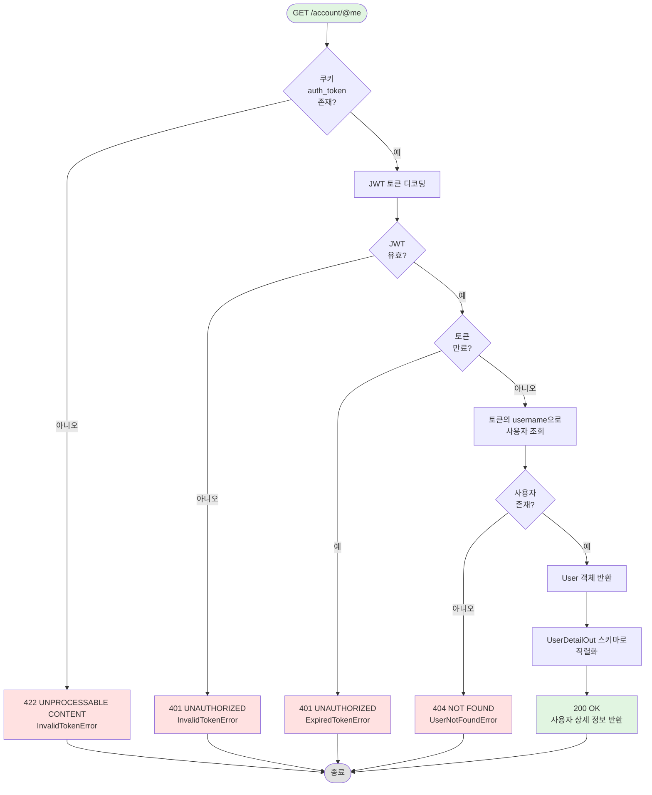

# 내 정보 조회 API 구현 문서

## [NOTE] 개요

인증된 사용자의 상세 정보를 조회하는 `GET /account/@me` 엔드포인트를 구현했습니다. 쿠키의 JWT 토큰을 검증하여 이메일, 생성일시, 수정일시 등 민감한 정보를 포함한 사용자 정보를 반환합니다.

## [GOAL] 유저 시나리오

### 시나리오 1: 유효한 토큰으로 내 정보 조회
**목표**: 유효한 인증 토큰으로 현재 사용자 정보를 조회한다

1. 사용자가 로그인하여 쿠키에 JWT 토큰을 받습니다
2. `GET /account/@me`로 요청을 보냅니다 (쿠키에 토큰 포함)
3. 서버가 쿠키에서 토큰을 추출하고 검증합니다:
   - 토큰이 존재함 O
   - 유효한 JWT 형식 O
   - 만료되지 않음 O
   - 사용자가 데이터베이스에 존재함 O
4. 서버가 사용자 상세 정보를 반환합니다:
   - username (사용자명)
   - display_name (표시 이름)
   - is_host (호스트 여부)
   - email (이메일)
   - created_at (생성 일시)
   - updated_at (수정 일시)
5. 사용자가 완전한 프로필 정보를 받습니다

**결과**: HTTP 200 OK + UserDetailOut

---

### 시나리오 2: 토큰 없이 접근
**목표**: 인증 토큰이 없을 때 접근을 차단한다

1. 사용자가 auth_token 쿠키 없이 `GET /account/@me`를 요청합니다
2. 서버가 쿠키에서 토큰을 확인합니다
3. 토큰이 없음 X
4. `InvalidTokenError` 예외 발생

**결과**: HTTP 422 UNPROCESSABLE CONTENT
```json
{
  "detail": "Invalid token"
}
```

---

### 시나리오 3: 유효하지 않은 토큰으로 접근
**목표**: 잘못된 형식이나 위조된 토큰을 거부한다

1. 사용자가 잘못된 토큰(예: "invalid_token")으로 요청합니다
2. 서버가 JWT 토큰 디코딩을 시도합니다
3. JWT 디코딩 실패 X
4. `InvalidTokenError` 예외 발생

**결과**: HTTP 401 UNAUTHORIZED
```json
{
  "detail": "Invalid token"
}
```

---

### 시나리오 4: 만료된 토큰으로 접근
**목표**: 유효 기간이 지난 토큰을 거부한다

1. 사용자가 만료된 토큰(exp 클레임이 과거)으로 요청합니다
2. 서버가 토큰을 성공적으로 디코딩합니다
3. 서버가 만료 시간을 확인합니다
4. 토큰이 만료됨 X
5. `ExpiredTokenError` 예외 발생

**결과**: HTTP 401 UNAUTHORIZED
```json
{
  "detail": "Token has expired"
}
```

---

### 시나리오 5: 토큰은 유효하지만 사용자가 존재하지 않음
**목표**: 토큰은 유효하지만 사용자가 삭제된 경우를 처리한다

1. 사용자가 유효한 토큰으로 요청합니다
2. 서버가 토큰을 성공적으로 디코딩합니다
3. 서버가 토큰의 username(sub 클레임)으로 데이터베이스를 조회합니다
4. 데이터베이스에서 사용자를 찾지 못함 X
5. `UserNotFoundError` 예외 발생

**결과**: HTTP 404 NOT FOUND
```json
{
  "detail": "User doesn't exist"
}
```

## [SECURITY] 보안 사양

### 토큰 검증
- **토큰 출처**: "auth_token"이라는 이름의 HTTP-only 쿠키
- **토큰 타입**: HS256 알고리즘을 사용하는 JWT
- **검증 단계**:
  1. 쿠키 존재 여부 확인
  2. JWT 구조 검증
  3. 서명 검증
  4. 만료 시간 확인
  5. 사용자 존재 여부 확인

### 접근 제어
- **인증 필수**: 예 (CurrentUserDep 사용)
- **쿠키 보안**: HttpOnly, Secure, SameSite=strict
- **공개 접근 불가**: 엔드포인트는 유효한 인증 필요

### 데이터 노출
- **공개 엔드포인트**: username, display_name, is_host만 노출
- **인증된 엔드포인트**: email, created_at, updated_at 포함
- **절대 노출 안 됨**: hashed_password

## [DIAGRAM] 시퀀스 다이어그램



## [FLOW] 인증 플로우차트



## [STRUCTURE] 구현 파일 구조

```
appserver/apps/account/
├── endpoints.py        # GET /@me 엔드포인트
├── deps.py            # get_current_user dependency, CurrentUserDep
├── schemas.py         # UserDetailOut 응답 모델
├── utils.py           # decode_token 함수
├── exceptions.py      # InvalidTokenError, ExpiredTokenError
└── models.py          # User 모델

tests/apps/account/
├── conftest.py        # client_with_auth 픽스처
└── test_me_api.py     # /@me 엔드포인트 테스트
```

## [API] API 명세

### GET /account/@me

**인증**: 필수 (쿠키의 JWT 토큰)

**Request:**
```http
GET /account/@me HTTP/1.1
Cookie: auth_token=eyJhbGciOiJIUzI1NiIsInR5cCI6IkpXVCJ9...
```

**Response (성공):**
```json
{
  "username": "zipsa1234",
  "display_name": "zipsahere",
  "is_host": true,
  "email": "test@example.com",
  "created_at": "2026-01-06T10:30:00Z",
  "updated_at": "2026-01-06T10:30:00Z"
}
```

**에러 응답:**

| 상태 코드 | 에러 | 설명 |
|----------|------|------|
| 422 | InvalidTokenError | 쿠키에 토큰 없음 |
| 401 | InvalidTokenError | 토큰이 유효하지 않거나 형식 오류 |
| 401 | ExpiredTokenError | 토큰이 만료됨 |
| 404 | UserNotFoundError | 토큰의 사용자가 존재하지 않음 |

**응답 헤더:**
- 추가 헤더 없음 (토큰은 이미 쿠키에 존재)

## [TEST] 테스트 커버리지

- [O] `test_get_my_info` - 유효한 토큰으로 사용자 정보 반환
- [O] `test_raises_suspicious_access_error_when_token_missing` - 토큰 없으면 422 반환
- [O] `test_raises_auth_error_when_token_invalid` - 유효하지 않은 토큰이면 401 반환
- [O] `test_get_my_info_with_expired_token` - 만료된 토큰이면 401 반환
- [O] `test_get_my_info_when_user_not_exists` - 사용자 없으면 404 반환

**모든 테스트 통과**: 5/5

## [NEXT] 다음 단계

1. `deps.py:27`의 토큰 만료 로직 수정 필요 (비교 연산자가 잘못된 것 같음)
2. 인증 엔드포인트에 rate limiting 추가
3. 인증 실패 시 로깅 추가
4. Refresh token 메커니즘 도입 고려
5. 사용자 활동 추적 추가 (last_login_at)

## 주요 코드 스니펫

### 엔드포인트 구현
```python
# appserver/apps/account/endpoints.py:101-103
@router.get("/@me", response_model=UserDetailOut)
async def me(user: CurrentUserDep) -> User:
    return user
```

### 인증 의존성
```python
# appserver/apps/account/deps.py:12-38
async def get_current_user(
        auth_token: Annotated[str | None, Cookie()],
        db_session: DbSessionDep,
):
    if auth_token is None:
        raise InvalidTokenError()

    try:
        decoded = decode_token(auth_token)
    except Exception as e:
        raise InvalidTokenError() from e

    expires_at = datetime.fromtimestamp(decoded["exp"], tz=timezone.utc)
    now = datetime.now(timezone.utc)
    if now + timedelta(minutes=ACCESS_TOKEN_EXPIRE_MINUTES) < expires_at:
        raise ExpiredTokenError()

    stmt = select(User).where(User.username == decoded["sub"])
    result = await db_session.execute(stmt)
    user = result.scalar_one_or_none()
    if user is None:
        raise UserNotFoundError()
    return user

CurrentUserDep = Annotated[User, Depends(get_current_user)]
```

### UserDetailOut 스키마
```python
# appserver/apps/account/schemas.py:40-43
class UserDetailOut(UserOut):
    email: EmailStr
    created_at: AwareDatetime
    updated_at: AwareDatetime
```

### 토큰 디코딩 유틸리티
```python
# appserver/apps/account/utils.py:37-38
def decode_token(token: str) -> dict:
    return jwt.decode(token, SECRET_KEY, algorithms=[ALGORITHM])
```

### 커스텀 예외
```python
# appserver/apps/account/exceptions.py:34-47
class InvalidTokenError(HTTPException):
    def __init__(self):
        super().__init__(
            status_code=status.HTTP_401_UNAUTHORIZED,
            detail="Invalid token",
        )

class ExpiredTokenError(HTTPException):
    def __init__(self):
        super().__init__(
            status_code=status.HTTP_401_UNAUTHORIZED,
            detail="Token has expired",
        )
```

## 버그 수정 이력

### 이슈: User 클래스를 인스턴스 대신 반환
**파일**: `appserver/apps/account/endpoints.py:103`

**문제**:
```python
return User  # X 클래스를 반환, 인스턴스가 아님
```

**에러**:
```
ResponseValidationError: 6 validation errors:
  'username': Input should be a valid string,
  input: <sqlalchemy.orm.attributes.InstrumentedAttribute object>
```

**해결**:
```python
return user  # O user 인스턴스 반환
```

**원인**: 오타 - user 파라미터 대신 User 클래스를 반환
**상태**: 수정 완료, 모든 테스트 통과

## 아키텍처 노트

### 의존성 주입 패턴
- FastAPI의 의존성 주입을 사용하여 인증 처리
- `CurrentUserDep`로 깔끔한 타입 힌트와 자동 검증 제공
- 인증 로직과 비즈니스 로직 분리

### 보안 우선 설계
- 어떤 응답에서도 비밀번호 노출 안 됨
- 이메일은 인증된 사용자에게만 표시
- JWT 검증이 엔드포인트 실행 전에 발생
- 쿠키 기반 인증으로 SameSite=strict를 통한 CSRF 방지

### 에러 처리 계층 구조
1. **422**: 인증 누락 (의심스러운 접근)
2. **401**: 인증 실패 (유효하지 않거나 만료된 토큰)
3. **404**: 인증되었지만 사용자 없음 (엣지 케이스)

이러한 분리는 클라이언트가 다양한 에러 시나리오를 구별하고 적절하게 처리할 수 있도록 합니다.
