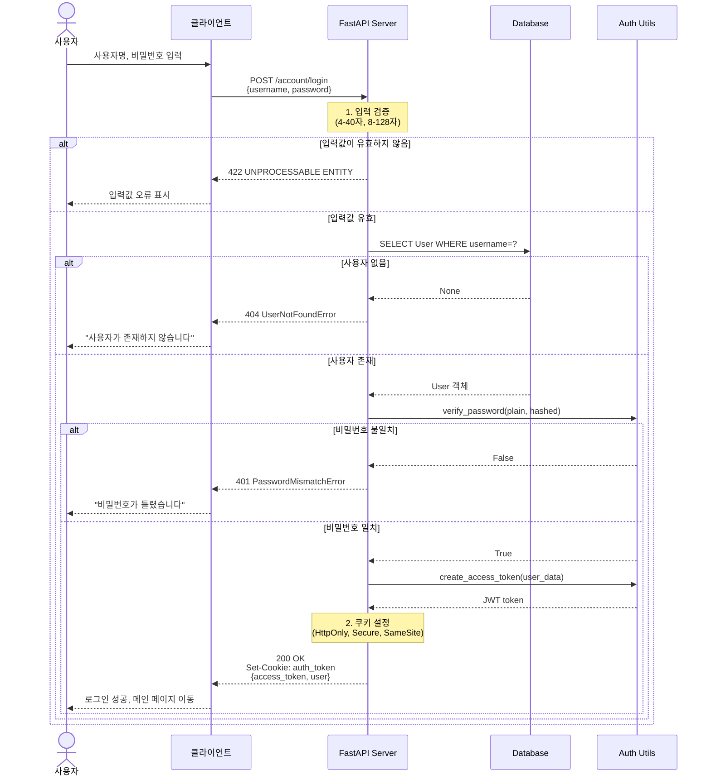
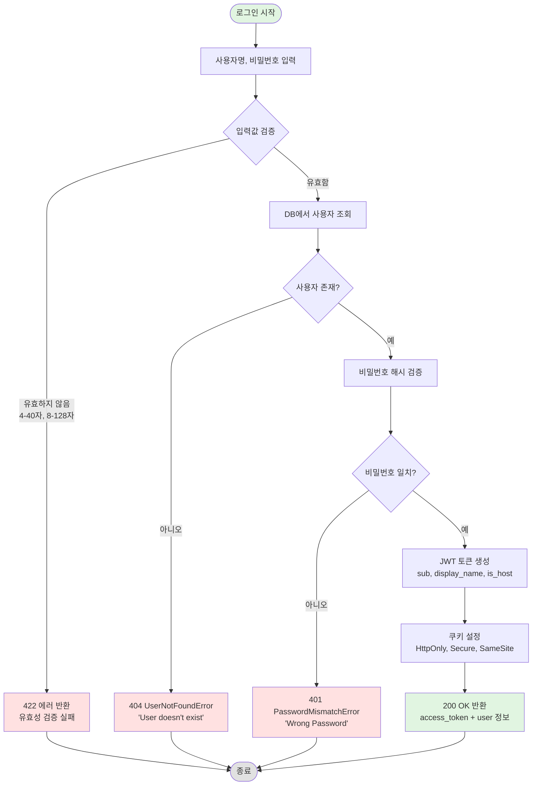

# 로그인 기능 구현 문서

## [NOTE] 개요

JWT 기반 인증을 사용하는 로그인 기능을 구현했습니다. 사용자명과 비밀번호를 검증하여 인증 토큰을 발급하고, HTTP-only 쿠키로 안전하게 전달합니다.

## [GOAL] 유저 시나리오

### 시나리오 1: 정상 로그인
**목표**: 올바른 계정 정보로 로그인하여 인증 토큰을 받는다

1. 사용자가 로그인 페이지에 접속합니다
2. 사용자명 "zipsa1234"와 비밀번호 "testtest"를 입력합니다
3. 서버가 요청을 검증합니다:
   - 사용자명: 4글자 이상 40글자 이하 O
   - 비밀번호: 8글자 이상 128글자 이하 O
4. 데이터베이스에서 사용자를 조회합니다
5. 비밀번호를 Argon2/Bcrypt로 해싱하여 비교합니다
6. 인증 성공 시:
   - JWT 액세스 토큰 생성 (30분 유효)
   - HTTP-only 쿠키에 토큰 저장
   - 사용자 정보 반환 (username, display_name, is_host)
7. 사용자가 인증된 상태로 서비스를 이용합니다

**결과**: HTTP 200 OK + 쿠키에 auth_token 설정

---

### 시나리오 2: 유효하지 않은 사용자명
**목표**: 존재하지 않는 계정으로 로그인 시도

1. 사용자가 존재하지 않는 사용자명 "unknown123"을 입력합니다
2. 서버가 데이터베이스를 조회하지만 사용자를 찾지 못합니다
3. `UserNotFoundError` 예외 발생

**결과**: HTTP 404 NOT FOUND
```json
{
  "detail": "User doesn't exist"
}
```

---

### 시나리오 3: 잘못된 비밀번호
**목표**: 올바른 사용자명이지만 잘못된 비밀번호로 시도

1. 사용자가 올바른 사용자명 "zipsa1234"를 입력합니다
2. 잘못된 비밀번호 "wrongpassword"를 입력합니다
3. 서버가 사용자를 조회합니다 O
4. 비밀번호 해시 검증에 실패합니다 X
5. `PasswordMismatchError` 예외 발생

**결과**: HTTP 401 UNAUTHORIZED
```json
{
  "detail": "Wrong Password"
}
```

---

### 시나리오 4: 유효성 검사 실패
**목표**: 규칙에 맞지 않는 입력값 처리

1. 사용자가 너무 짧은 사용자명 "abc" (3글자)를 입력합니다
2. FastAPI의 Pydantic 검증이 요청을 거부합니다

**결과**: HTTP 422 UNPROCESSABLE ENTITY
```json
{
  "detail": [
    {
      "loc": ["body", "username"],
      "msg": "String should have at least 4 characters",
      "type": "string_too_short"
    }
  ]
}
```

## [SECURITY] 보안 사양

### 입력 검증
- **사용자명**: 4~40자
- **비밀번호**: 8~128자 (평문으로 전송, HTTPS 필수)

### 비밀번호 보안
- **해싱 알고리즘**: Argon2 + Bcrypt (pwdlib)
- **저장 형태**: 해시된 값만 DB에 저장
- **검증 방식**: 평문 비밀번호를 해시와 비교

### JWT 토큰
- **알고리즘**: HS256
- **유효 기간**: 30분
- **페이로드**:
  ```json
  {
    "sub": "zipsa1234",
    "display_name": "집사입니다",
    "is_host": true,
    "exp": 1704567890
  }
  ```

### 쿠키 보안
- **HttpOnly**: O (JavaScript 접근 차단)
- **Secure**: O (HTTPS만)
- **SameSite**: strict (CSRF 방어)
- **만료 시간**: 30분

## [DIAGRAM] 시퀀스 다이어그램



## [FLOW] 로그인 플로우차트



## [STRUCTURE] 구현 파일 구조

```
appserver/apps/account/
├── schemas.py          # LoginPayload 정의
├── models.py           # User 모델 (hashed_password)
├── utils.py            # hash_password, verify_password, create_access_token
├── endpoints.py        # POST /account/login 엔드포인트
└── exceptions.py       # UserNotFoundError, PasswordMismatchError

tests/apps/account/
├── conftest.py         # host_user 픽스처
└── test_login_api.py   # 로그인 API 테스트
```

## [API] API 명세

### POST /account/login

**Request:**
```json
{
  "username": "zipsa1234",
  "password": "testtest"
}
```

**Response (성공):**
```json
{
  "access_token": "eyJhbGciOiJIUzI1NiIsInR5cCI6IkpXVCJ9...",
  "token_type": "bearer",
  "user": {
    "username": "zipsa1234",
    "display_name": "집사입니다",
    "is_host": true
  }
}
```

**Headers:**
```
Set-Cookie: auth_token=eyJhbGciOiJIUzI1NiIsInR5cCI6IkpXVCJ9...;
            HttpOnly; Secure; SameSite=Strict;
            Expires=Mon, 06 Jan 2026 15:30:00 GMT
```

**에러 응답:**
- `422`: 입력값 유효성 검증 실패
- `404`: 사용자가 존재하지 않음
- `401`: 비밀번호 불일치

## [TEST] 테스트 커버리지

- [O] 정상 로그인 테스트 (`test_login_successfully`)
- [X] 사용자 없음 테스트 (TODO)
- [X] 비밀번호 불일치 테스트 (TODO)
- [X] 유효성 검증 실패 테스트 (TODO)

## [NEXT] 다음 단계

1. SECRET_KEY를 환경변수로 이동
2. 추가 테스트 케이스 작성
3. 불필요한 import 제거 (endpoints.py:1-2)
4. 타입 힌트 수정 (endpoints.py:56, 66)
5. 오타 수정 (exceptions.py:22 "dosen't" → "doesn't")

## 주요 코드 스니펫

### LoginPayload 스키마
```python
# appserver/apps/account/schemas.py:35-38
class LoginPayload(SQLModel):
    username: str = Field(min_length=4, max_length=40)
    password: str = Field(min_length=8, max_length=128)
```

### 로그인 엔드포인트
```python
# appserver/apps/account/endpoints.py:55-94
@router.post("/login", status_code=status.HTTP_200_OK)
async def login(payload: LoginPayload, session: DbSessionDep) -> User:
    # 1. 사용자 조회
    stmt = select(User).where(User.username == payload.username)
    result = await session.execute(stmt)
    user = result.scalar_one_or_none()

    if user is None:
        raise UserNotFoundError()

    # 2. 비밀번호 검증
    is_valid = verify_password(payload.password, user.hashed_password)
    if not is_valid:
        raise PasswordMismatchError

    # 3. JWT 토큰 생성
    access_token_expires = timedelta(minutes=ACCESS_TOKEN_EXPIRE_MINUTES)
    access_token = create_access_token(
        data={
            "sub": user.username,
            "display_name": user.display_name,
            "is_host": user.is_host,
        },
        expires_delta = access_token_expires
    )

    # 4. 응답 데이터 구성
    response_data = {
        "access_token": access_token,
        "token_type": "bearer",
        "user": user.model_dump(mode="json", exclude={"hashed_password", "email"})
    }

    # 5. 쿠키 설정
    res = JSONResponse(response_data, status_code=status.HTTP_200_OK)
    res.set_cookie(
        key="auth_token",
        value=access_token,
        expires=datetime.now(timezone.utc) + timedelta(minutes=ACCESS_TOKEN_EXPIRE_MINUTES),
        httponly=True,
        secure=True,
        samesite="strict"
    )
    return res
```

### 비밀번호 검증 유틸리티
```python
# appserver/apps/account/utils.py:31-33
def verify_password(plain_password: str, hashed_password: str) -> bool:
    password_hasher = PasswordHash((Argon2Hasher(), BcryptHasher()))
    return password_hasher.verify(plain_password, hashed_password)
```

### JWT 토큰 생성
```python
# appserver/apps/account/utils.py:13-23
def create_access_token(data: dict, expires_delta: Union[timedelta, None] = None) -> str:
    to_encode = data.copy()
    now = datetime.now(timezone.utc)
    if expires_delta:
        expire = now + expires_delta
    else:
        expire = now + timedelta(minutes=ACCESS_TOKEN_EXPIRE_MINUTES)

    to_encode.update({"exp": expire})
    encoded_jwt = jwt.encode(to_encode, SECRET_KEY, algorithm=ALGORITHM)
    return encoded_jwt
```

## 커밋 정보

**커밋 해시**: 76936bd
**커밋 메시지**: feat(auth): implement login endpoint with JWT authentication

**변경 사항**:
- 7 files changed, 147 insertions(+), 8 deletions(-)
- 새 파일: `appserver/apps/account/utils.py`, `tests/apps/account/test_login_api.py`
