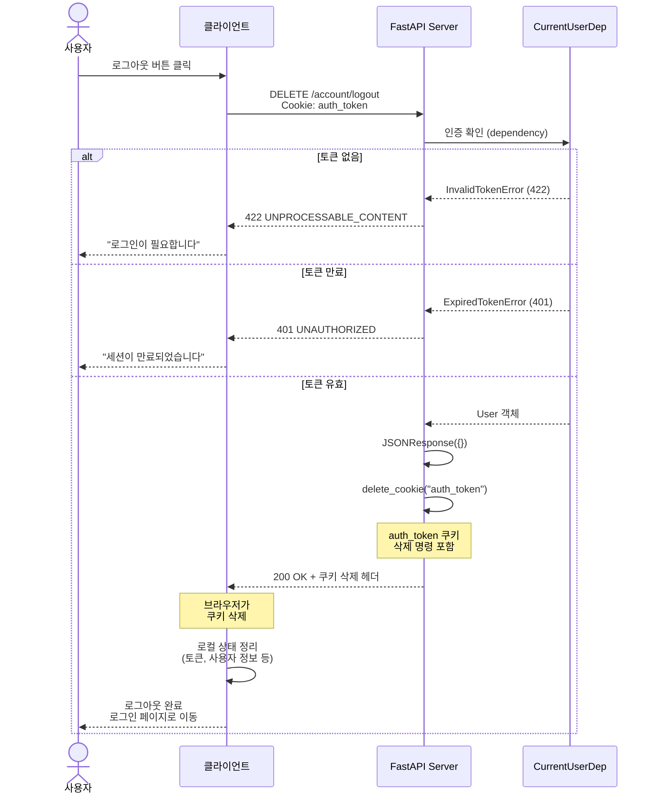
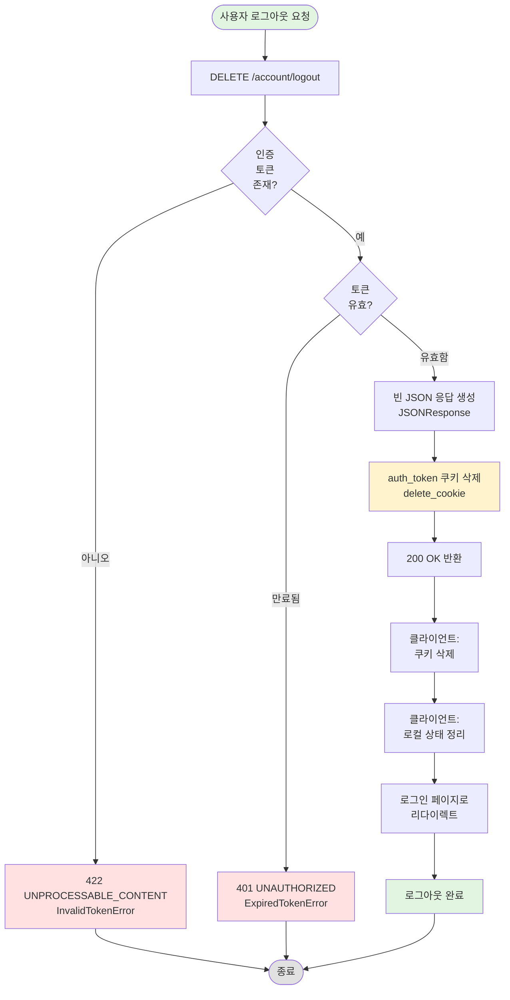

# 로그아웃 API 구현 문서

## [NOTE] 개요

인증된 사용자가 로그아웃할 수 있는 `DELETE /account/logout` 엔드포인트를 구현했습니다. 로그아웃 시 인증 토큰이 담긴 쿠키를 삭제하여 세션을 종료합니다.

## [GOAL] 유저 시나리오

### 시나리오 1: 정상 로그아웃
**목표**: 로그인된 사용자가 로그아웃하여 인증 토큰을 제거한다

1. 사용자가 로그인된 상태입니다 (auth_token 쿠키 존재)
2. 사용자가 로그아웃 버튼을 클릭합니다
3. 클라이언트가 `DELETE /account/logout` 요청을 보냅니다
4. 서버가 인증 토큰을 확인합니다:
   - CurrentUserDep으로 자동 인증 검증 O
   - 유효한 토큰 O
5. 서버가 auth_token 쿠키를 삭제합니다
6. 빈 JSON 응답과 함께 200 OK 반환
7. 클라이언트의 auth_token 쿠키가 제거됩니다
8. 사용자가 로그아웃 상태가 됩니다

**결과**: HTTP 200 OK + auth_token 쿠키 삭제

---

### 시나리오 2: 인증 없이 로그아웃 시도
**목표**: 로그인하지 않은 사용자의 로그아웃 시도를 차단한다

1. 사용자가 로그인하지 않은 상태입니다 (auth_token 쿠키 없음)
2. 사용자가 `DELETE /account/logout` 요청을 시도합니다
3. CurrentUserDep에서 get_current_user 호출
4. 토큰이 없어 InvalidTokenError 발생

**결과**: HTTP 422 UNPROCESSABLE_CONTENT
```json
{
  "detail": "Invalid token"
}
```

---

### 시나리오 3: 만료된 토큰으로 로그아웃 시도
**목표**: 이미 만료된 토큰으로 로그아웃 시도 시 거부한다

1. 사용자의 토큰이 만료되었습니다
2. 사용자가 `DELETE /account/logout` 요청을 시도합니다
3. CurrentUserDep에서 토큰 검증
4. 토큰이 만료되어 ExpiredTokenError 발생

**결과**: HTTP 401 UNAUTHORIZED
```json
{
  "detail": "Token has expired"
}
```

---

## [SECURITY] 보안 사양

### 인증 요구사항
- **필수**: JWT 토큰 (HTTP-only 쿠키)
- **검증**: CurrentUserDep dependency를 통한 자동 검증
- **권한**: 로그인된 사용자만 로그아웃 가능

### 쿠키 삭제
- **메서드**: `delete_cookie(AUTH_TOKEN_COOKIE_NAME)`
- **쿠키명**: "auth_token"
- **완전 삭제**: 클라이언트에서 쿠키 완전 제거
- **세션 종료**: 인증 상태 완전히 해제

### 로그아웃 후 상태
- **인증 불가**: 이후 모든 인증 요구 API 접근 불가
- **재로그인 필요**: 다시 사용하려면 로그인 필요
- **토큰 무효화**: 기존 토큰으로 접근 불가

## [DIAGRAM] 시퀀스 다이어그램



## [FLOW] 로그아웃 플로우차트



## [STRUCTURE] 구현 파일 구조

```
appserver/apps/account/
├── endpoints.py        # DELETE /logout 엔드포인트
├── deps.py             # CurrentUserDep (인증 의존성)
├── constants.py        # AUTH_TOKEN_COOKIE_NAME 상수
└── exceptions.py       # InvalidTokenError, ExpiredTokenError

tests/apps/account/
├── conftest.py         # client_with_auth 픽스처
└── test_logout_api.py  # 로그아웃 API 테스트
```

## [API] API 명세

### DELETE /account/logout

**인증**: 필수 (JWT 토큰 in 쿠키)

**Request:**
```http
DELETE /account/logout HTTP/1.1
Cookie: auth_token=eyJhbGciOiJIUzI1NiIsInR5cCI6IkpXVCJ9...
```

**Response (성공):**
```json
{}
```

**Response Headers:**
```http
HTTP/1.1 200 OK
Set-Cookie: auth_token=; Max-Age=0; Path=/; HttpOnly; Secure; SameSite=Strict
```

**에러 응답:**

| 상태 코드 | 에러 | 설명 |
|----------|------|------|
| 422 | InvalidTokenError | 토큰 누락 (로그인 안 됨) |
| 401 | ExpiredTokenError | 토큰 만료 |

## [TEST] 테스트 커버리지

### 테스트 케이스
- [O] `test_auth_token_must_be_removed_when_logout` - 로그아웃 시 토큰 쿠키 삭제 확인

**총 테스트**: 1개 (통과)

### 추가 권장 테스트
- [ ] 인증 없이 로그아웃 시도 (422 에러)
- [ ] 만료된 토큰으로 로그아웃 시도 (401 에러)
- [ ] 로그아웃 후 인증 필요 API 접근 시도 (거부 확인)

## [NEXT] 다음 단계

1. 추가 테스트 케이스 작성 (인증 없음, 만료된 토큰)
2. 로그아웃 이력 로깅 (감사 로그)
3. 모든 디바이스에서 로그아웃 기능 (세션 관리)
4. Refresh token 무효화 (구현 시)
5. 로그아웃 후 리다이렉트 URL 지정

## 주요 코드 스니펫

### 로그아웃 엔드포인트
```python
# appserver/apps/account/endpoints.py:120-124
@router.delete("/logout", status_code=status.HTTP_200_OK)
async def logout(user: CurrentUserDep) -> JSONResponse:
    res = JSONResponse({})
    res.delete_cookie(AUTH_TOKEN_COOKIE_NAME)
    return res
```

### 쿠키 이름 상수
```python
# appserver/apps/account/constants.py:1
AUTH_TOKEN_COOKIE_NAME = "auth_token"
```

### 테스트 케이스
```python
# tests/apps/account/test_logout_api.py:7-11
async def test_auth_token_must_be_removed_when_logout(
    client_with_auth: TestClient,
):
    response = client_with_auth.delete("/account/logout")
    assert response.status_code == status.HTTP_200_OK
    assert response.cookies.get(AUTH_TOKEN_COOKIE_NAME) is None
```

## 아키텍처 노트

### 간결한 구현
- **최소 로직**: 단순히 쿠키만 삭제
- **상태 비저장**: 서버에서 별도 세션 관리 없음
- **JWT 특성**: 토큰 자체가 상태를 가지므로 서버에서 무효화 불필요
- **클라이언트 책임**: 쿠키 삭제 후 상태 정리는 클라이언트가 처리

### 보안 고려사항
- **인증 필요**: 로그인된 사용자만 로그아웃 가능
- **완전한 삭제**: delete_cookie로 쿠키 완전 제거
- **재사용 불가**: 삭제된 토큰은 재사용 불가

### HTTP 메서드 선택
- **DELETE 사용**: 로그아웃은 인증 상태(세션)를 삭제하는 행위
- **RESTful**: 리소스(세션) 삭제에 적합한 메서드
- **멱등성**: 여러 번 호출해도 결과 동일

### 쿠키 삭제 메커니즘
FastAPI의 `delete_cookie()`는 다음과 같이 동작:
1. Max-Age=0 설정하여 즉시 만료
2. 기존과 동일한 쿠키 속성 사용 (Path, Domain 등)
3. 브라우저가 쿠키 삭제

## 관련 API

### 인증 플로우
```
POST /account/login
  → 로그인 성공
  → auth_token 쿠키 설정
  → 인증된 상태

GET /account/@me
  → 인증 토큰 확인
  → 사용자 정보 반환

DELETE /account/logout
  → auth_token 쿠키 삭제
  → 로그아웃 상태
```

### 세션 관리
현재는 JWT 기반으로 서버에서 별도 세션 저장소를 사용하지 않습니다:
- **장점**: 확장성 좋음, 서버 부담 적음
- **단점**: 토큰 즉시 무효화 불가
- **대안**: Refresh token 패턴, Redis 기반 블랙리스트
