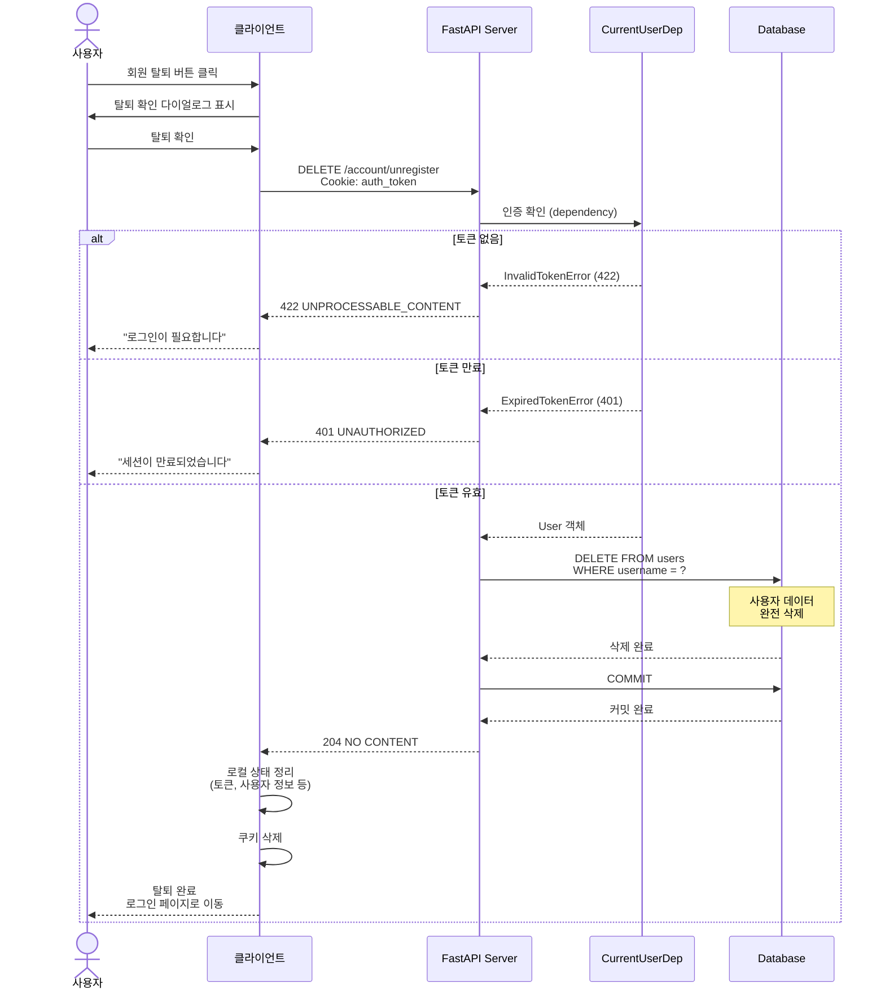
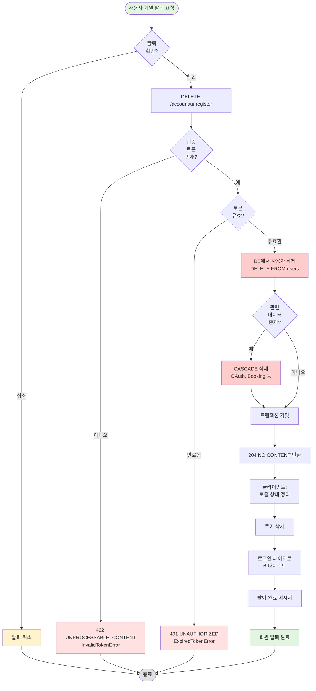

# 회원 탈퇴 API 구현 문서

## [NOTE] 개요

인증된 사용자가 자신의 계정을 삭제(탈퇴)할 수 있는 `DELETE /account/unregister` 엔드포인트를 구현했습니다. 회원 탈퇴 시 데이터베이스에서 사용자 정보가 완전히 삭제됩니다.

## [GOAL] 유저 시나리오

### 시나리오 1: 정상 회원 탈퇴
**목표**: 로그인된 사용자가 자신의 계정을 삭제한다

1. 사용자가 로그인된 상태입니다 (auth_token 쿠키 존재)
2. 사용자가 회원 탈퇴를 결정하고 확인합니다
3. 클라이언트가 `DELETE /account/unregister` 요청을 보냅니다
4. 서버가 인증 토큰을 확인합니다:
   - CurrentUserDep으로 자동 인증 검증 O
   - 유효한 토큰 O
5. 서버가 사용자 정보를 데이터베이스에서 삭제합니다:
   - `DELETE FROM users WHERE username = ?`
   - 완전히 삭제됨 (복구 불가)
6. 트랜잭션 커밋
7. 204 No Content 응답 반환 (본문 없음)
8. 클라이언트가 로그아웃 처리 및 로그인 페이지로 이동

**결과**: HTTP 204 NO CONTENT + DB에서 사용자 삭제

---

### 시나리오 2: 인증 없이 회원 탈퇴 시도
**목표**: 로그인하지 않은 사용자의 탈퇴 시도를 차단한다

1. 사용자가 로그인하지 않은 상태입니다 (auth_token 쿠키 없음)
2. 사용자가 `DELETE /account/unregister` 요청을 시도합니다
3. CurrentUserDep에서 get_current_user 호출
4. 토큰이 없어 InvalidTokenError 발생

**결과**: HTTP 422 UNPROCESSABLE_CONTENT
```json
{
  "detail": "Invalid token"
}
```

---

### 시나리오 3: 만료된 토큰으로 회원 탈퇴 시도
**목표**: 이미 만료된 토큰으로 탈퇴 시도 시 거부한다

1. 사용자의 토큰이 만료되었습니다
2. 사용자가 `DELETE /account/unregister` 요청을 시도합니다
3. CurrentUserDep에서 토큰 검증
4. 토큰이 만료되어 ExpiredTokenError 발생

**결과**: HTTP 401 UNAUTHORIZED
```json
{
  "detail": "Token has expired"
}
```

---

### 시나리오 4: 탈퇴 후 재접근 시도
**목표**: 탈퇴한 사용자의 토큰은 무효화된다

1. 사용자가 회원 탈퇴를 완료했습니다 (DB에서 삭제됨)
2. 사용자가 기존 토큰으로 다른 API 접근을 시도합니다
3. CurrentUserDep에서 토큰 디코딩 성공
4. DB에서 사용자 조회 → 없음
5. UserNotFoundError 발생

**결과**: HTTP 404 NOT FOUND
```json
{
  "detail": "User doesn't exist"
}
```

---

## [SECURITY] 보안 사양

### 인증 요구사항
- **필수**: JWT 토큰 (HTTP-only 쿠키)
- **검증**: CurrentUserDep dependency를 통한 자동 검증
- **권한**: 자기 자신의 계정만 삭제 가능

### 데이터 삭제
- **완전 삭제**: 데이터베이스에서 영구 삭제
- **복구 불가**: 소프트 삭제가 아닌 하드 삭제
- **CASCADE**: 관련 데이터도 함께 삭제될 수 있음 (외래키 설정에 따라)

### 탈퇴 후 상태
- **즉시 무효화**: 기존 토큰으로 모든 API 접근 불가
- **재가입 가능**: 동일한 username/email로 재가입 가능
- **데이터 완전 삭제**: 개인정보 즉시 삭제

### 권장 추가 보안
- **비밀번호 재확인**: 탈퇴 전 비밀번호 입력 요구 (클라이언트에서 구현)
- **유예 기간**: 즉시 삭제 대신 30일 유예 (소프트 삭제)
- **탈퇴 사유**: 탈퇴 사유 수집 (개선 목적)
- **재가입 제한**: 동일 계정 재가입 제한 기간 설정

## [DIAGRAM] 시퀀스 다이어그램



## [FLOW] 회원 탈퇴 플로우차트



## [STRUCTURE] 구현 파일 구조

```
appserver/apps/account/
├── endpoints.py        # DELETE /unregister 엔드포인트
├── deps.py             # CurrentUserDep (인증 의존성)
├── models.py           # User 모델 (CASCADE 설정)
└── exceptions.py       # InvalidTokenError, ExpiredTokenError

tests/apps/account/
├── conftest.py         # client_with_auth, host_user 픽스처
└── test_unregister_api.py  # 회원 탈퇴 API 테스트
```

## [API] API 명세

### DELETE /account/unregister

**인증**: 필수 (JWT 토큰 in 쿠키)

**Request:**
```http
DELETE /account/unregister HTTP/1.1
Cookie: auth_token=eyJhbGciOiJIUzI1NiIsInR5cCI6IkpXVCJ9...
```

**Response (성공):**
```http
HTTP/1.1 204 No Content
```
(본문 없음)

**에러 응답:**

| 상태 코드 | 에러 | 설명 |
|----------|------|------|
| 422 | InvalidTokenError | 토큰 누락 (로그인 안 됨) |
| 401 | ExpiredTokenError | 토큰 만료 |

**참고**:
- 204 No Content는 본문을 반환하지 않음
- 탈퇴 후 즉시 기존 토큰 무효화 (DB에서 사용자 삭제됨)

## [TEST] 테스트 커버리지

### 테스트 케이스
- [O] `test_user_is_deleted_when_unregister` - 회원 탈퇴 시 DB에서 사용자 삭제 확인
  - 탈퇴 전: DB에 사용자 존재 확인
  - API 호출: DELETE /account/unregister
  - 탈퇴 후: DB에서 사용자 조회 시 None 반환
  - 응답 확인: 204 NO CONTENT

**총 테스트**: 1개 (통과)

### 추가 권장 테스트
- [ ] 인증 없이 회원 탈퇴 시도 (422 에러)
- [ ] 만료된 토큰으로 회원 탈퇴 시도 (401 에러)
- [ ] 탈퇴 후 동일 토큰으로 API 접근 (404 에러)
- [ ] 관련 데이터 CASCADE 삭제 확인 (OAuth, Booking 등)
- [ ] 탈퇴 후 재가입 가능 여부 확인

## [NEXT] 다음 단계

1. 소프트 삭제 구현 (deleted_at 필드 추가)
2. 탈퇴 유예 기간 설정 (30일)
3. 탈퇴 사유 수집 및 저장
4. 비밀번호 재확인 엔드포인트 추가
5. CASCADE 삭제 관련 데이터 정리 확인
6. 탈퇴 이력 로깅 (감사 로그)
7. 재가입 제한 기간 설정 옵션
8. 탈퇴 알림 메일 발송

## 주요 코드 스니펫

### 회원 탈퇴 엔드포인트
```python
# appserver/apps/account/endpoints.py:127-132
@router.delete("/unregister", status_code=status.HTTP_204_NO_CONTENT)
async def unregister(user: CurrentUserDep, session: DbSessionDep) -> None:
    stmt = delete(User).where(User.username == user.username)
    await session.execute(stmt)
    await session.commit()
    return None
```

### 테스트 케이스
```python
# tests/apps/account/test_unregister_api.py:7-15
async def test_user_is_deleted_when_unregister(
    client_with_auth: TestClient,
    host_user: User,
    db_session: AsyncSession,
):
    user_id = host_user.id

    # 탈퇴 전: 사용자 존재 확인
    assert await db_session.get(User, user_id) is not None

    # 회원 탈퇴 API 호출
    response = client_with_auth.delete("/account/unregister")

    # 검증
    assert response.status_code == status.HTTP_204_NO_CONTENT
    assert await db_session.get(User, user_id) is None
```

## 아키텍처 노트

### 하드 삭제 vs 소프트 삭제

**현재 구현: 하드 삭제**
- **장점**: 즉시 완전 삭제, GDPR 준수 용이
- **단점**: 복구 불가, 통계 데이터 손실

**권장: 소프트 삭제 전환**
```python
# 소프트 삭제 예시
class User(SQLModel, table=True):
    deleted_at: datetime | None = None

@router.delete("/unregister")
async def unregister(user: CurrentUserDep, session: DbSessionDep):
    stmt = update(User).where(User.username == user.username).values(
        deleted_at=datetime.now(timezone.utc)
    )
    await session.execute(stmt)
    await session.commit()
```

### CASCADE 삭제 고려사항

User 모델과 관련된 데이터:
```python
# models.py에서 확인된 관계
User:
  - oauth_accounts: list["OAuthAccount"]
  - calendar: "Calendar"
  - bookings: list["Booking"]
```

**CASCADE 설정 필요**:
- OAuthAccount: ON DELETE CASCADE (사용자 삭제 시 함께 삭제)
- Calendar: ON DELETE CASCADE (호스트 삭제 시 캘린더도 삭제)
- Booking: ON DELETE SET NULL 또는 CASCADE (예약 이력 유지 여부)

### HTTP 상태 코드 선택

**204 No Content 사용 이유**:
- DELETE 요청 성공 시 표준 응답
- 반환할 리소스가 없음을 명확히 표현
- 클라이언트가 추가 처리 불필요
- 대안: 200 OK + `{"message": "deleted"}` (덜 RESTful)

### 보안 고려사항

**현재 구현**:
- 인증된 사용자만 자신의 계정 삭제 가능
- 다른 사용자의 계정은 삭제 불가 (CurrentUserDep)

**개선 필요**:
- 비밀번호 재확인 (중요한 작업)
- CSRF 토큰 검증 (POST로 변경 고려)
- Rate limiting (계정 삭제 남용 방지)
- 탈퇴 쿨다운 (재가입 제한)

### 클라이언트 측 처리 필요사항

```javascript
// 회원 탈퇴 처리 예시
async function unregister() {
  // 1. 확인 다이얼로그
  const confirmed = confirm("정말 탈퇴하시겠습니까? 이 작업은 되돌릴 수 없습니다.");
  if (!confirmed) return;

  // 2. API 호출
  const response = await fetch("/account/unregister", {
    method: "DELETE",
    credentials: "include",
  });

  // 3. 성공 처리 (204)
  if (response.status === 204) {
    // 로컬 상태 정리
    localStorage.clear();
    sessionStorage.clear();

    // 로그인 페이지로 이동
    window.location.href = "/login?msg=unregistered";
  }
}
```

## 데이터베이스 스키마 고려사항

### 외래키 CASCADE 설정 확인
```sql
-- OAuthAccount 테이블
ALTER TABLE oauth_accounts
ADD CONSTRAINT fk_user
FOREIGN KEY (user_id) REFERENCES users(id)
ON DELETE CASCADE;

-- Calendar 테이블
ALTER TABLE calendars
ADD CONSTRAINT fk_host
FOREIGN KEY (host_id) REFERENCES users(id)
ON DELETE CASCADE;

-- Booking 테이블 (이력 유지)
ALTER TABLE bookings
ADD CONSTRAINT fk_guest
FOREIGN KEY (guest_id) REFERENCES users(id)
ON DELETE SET NULL;
```

### 소프트 삭제 전환 시 쿼리 수정
```python
# 모든 쿼리에 deleted_at IS NULL 조건 추가
stmt = select(User).where(
    User.username == username,
    User.deleted_at.is_(None)  # 삭제되지 않은 사용자만
)
```
