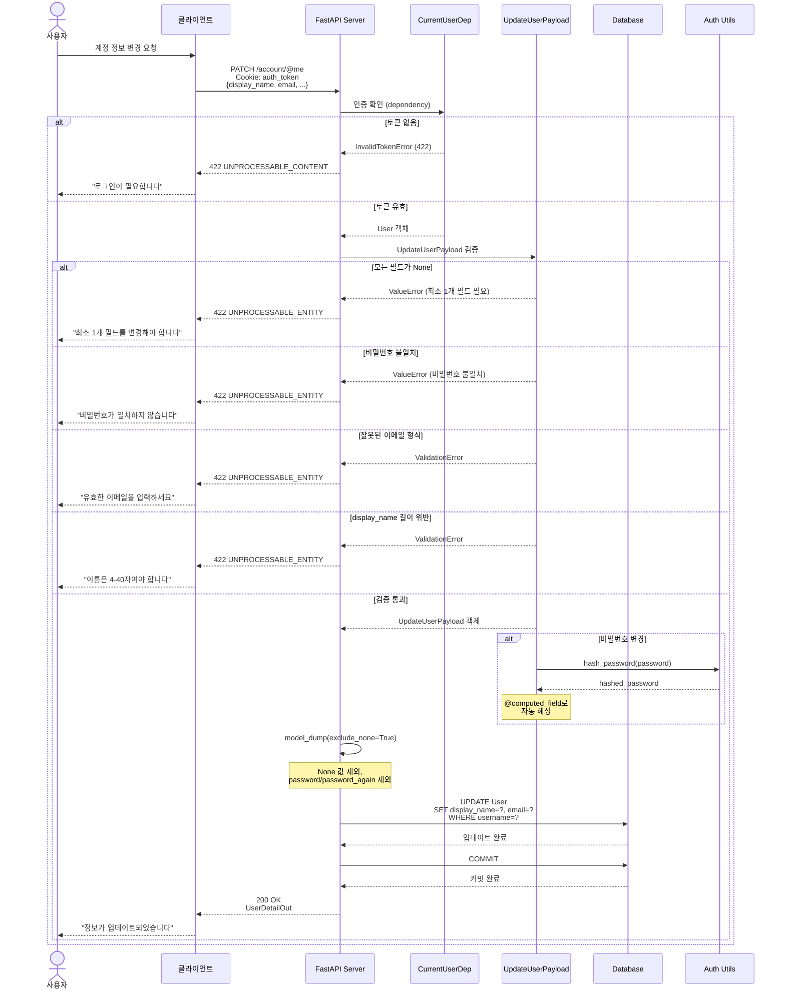
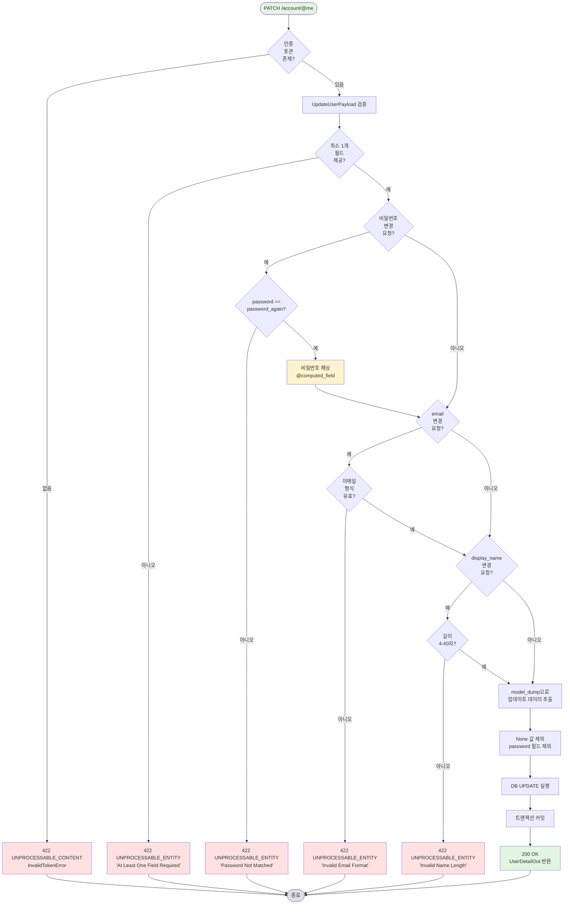
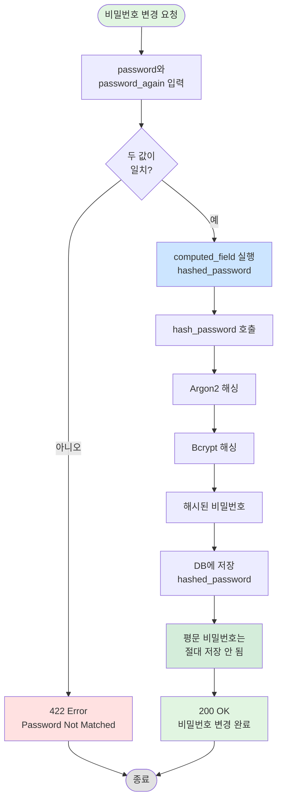

# 계정 정보 변경 API 구현 문서

## [NOTE] 개요

인증된 사용자가 자신의 계정 정보를 부분 업데이트할 수 있는 `PATCH /account/@me` 엔드포인트를 구현했습니다. 사용자는 변경하고 싶은 필드만 선택적으로 업데이트할 수 있으며, 비밀번호 변경 시 자동으로 해싱 처리됩니다.

## [GOAL] 유저 시나리오

### 시나리오 1: 부분 업데이트 - display_name만 변경
**목표**: 표시 이름만 변경하고 다른 정보는 유지한다

1. 사용자가 로그인된 상태에서 display_name 변경 요청
2. `PATCH /account/@me`로 `{"display_name": "zipsahere"}` 전송
3. 서버가 요청을 검증:
   - 인증 토큰 유효 O
   - display_name 길이 4-40자 O
   - 최소 1개 필드 제공 O
4. display_name만 업데이트
5. email, is_host 등 다른 필드는 기존 값 유지
6. 업데이트된 사용자 정보 반환

**결과**: HTTP 200 OK + 업데이트된 UserDetailOut

---

### 시나리오 2: 부분 업데이트 - email만 변경
**목표**: 이메일만 변경하고 다른 정보는 유지한다

1. 사용자가 `{"email": "zipsa@example.com"}` 전송
2. 서버가 이메일 형식 검증
3. email만 업데이트, display_name은 기존 값 유지
4. 업데이트된 정보 반환

**결과**: HTTP 200 OK

---

### 시나리오 3: 복수 필드 업데이트
**목표**: 여러 필드를 동시에 변경한다

1. 사용자가 여러 필드를 함께 전송:
```json
{
  "display_name": "zipsahere",
  "email": "zipsa@example.com"
}
```
2. 모든 제공된 필드가 검증됨
3. 모든 제공된 필드가 업데이트됨
4. 제공되지 않은 필드는 기존 값 유지

**결과**: HTTP 200 OK

---

### 시나리오 4: 빈 업데이트 시도
**목표**: 빈 페이로드로 요청 시 거부한다

1. 사용자가 빈 객체 `{}` 전송
2. UpdateUserPayload의 `check_all_fields_are_none` 검증 실패
3. ValueError 발생

**결과**: HTTP 422 UNPROCESSABLE_ENTITY
```json
{
  "detail": "It Must Be Provided At Least One Field"
}
```

---

### 시나리오 5: 비밀번호 변경 및 해싱
**목표**: 비밀번호 변경 시 자동으로 해싱 처리한다

1. 사용자가 새 비밀번호 입력:
```json
{
  "password": "new_password",
  "password_again": "new_password"
}
```
2. 서버가 두 비밀번호가 일치하는지 확인 O
3. `computed_field`에서 자동으로 해싱 처리
4. DB에 해시된 비밀번호 저장
5. 평문 비밀번호는 절대 저장되지 않음

**결과**: HTTP 200 OK + 해시된 비밀번호가 DB에 저장됨

---

### 시나리오 6: 비밀번호 불일치
**목표**: password와 password_again이 다르면 거부한다

1. 사용자가 일치하지 않는 비밀번호 전송:
```json
{
  "password": "new_password",
  "password_again": "different_password"
}
```
2. `verify_password` 검증 실패
3. ValueError 발생

**결과**: HTTP 422 UNPROCESSABLE_ENTITY
```json
{
  "detail": "Password Not Matched"
}
```

---

### 시나리오 7: 잘못된 이메일 형식
**목표**: 유효하지 않은 이메일 형식을 거부한다

**테스트 케이스**:
- `"notanemail"` - @ 기호 없음
- `"@example.com"` - 로컬 파트 없음
- `"user@"` - 도메인 없음
- `"user@domain"` - TLD 없음
- `"user name@domain.com"` - 공백 포함

1. 사용자가 잘못된 형식의 이메일 전송
2. Pydantic EmailStr 검증 실패
3. ValidationError 발생

**결과**: HTTP 422 UNPROCESSABLE_ENTITY

---

### 시나리오 8: display_name 길이 제한 위반
**목표**: 4-40자 제한을 벗어나면 거부한다

**테스트 케이스 (너무 짧음)**:
- `"abc"` - 3자
- `"ab"` - 2자
- `"a"` - 1자

**테스트 케이스 (너무 김)**:
- 41자 이상
- 50자

1. 사용자가 제한을 벗어난 길이의 이름 전송
2. Field 검증 실패 (min_length=4, max_length=40)
3. ValidationError 발생

**결과**: HTTP 422 UNPROCESSABLE_ENTITY

---

### 시나리오 9: 인증 없이 접근
**목표**: 로그인하지 않은 사용자의 접근을 차단한다

1. 사용자가 인증 토큰 없이 요청
2. CurrentUserDep에서 get_current_user 호출
3. 토큰이 없어 InvalidTokenError 발생

**결과**: HTTP 422 UNPROCESSABLE_CONTENT (토큰 누락)

---

## [SECURITY] 보안 사양

### 인증 요구사항
- **필수**: JWT 토큰 (HTTP-only 쿠키)
- **검증**: CurrentUserDep dependency를 통한 자동 검증
- **권한**: 자기 자신의 정보만 수정 가능

### 비밀번호 보안
- **저장 방식**: 해시만 저장 (평문 절대 저장 안 됨)
- **해싱 알고리즘**: Argon2 + Bcrypt (pwdlib)
- **자동 처리**: `@computed_field`로 자동 해싱
- **검증**: password와 password_again 일치 확인

### 입력 검증
- **display_name**: 4-40자
- **email**: EmailStr 타입 (Pydantic 자동 검증)
- **password**: 8-128자
- **최소 필드**: 최소 1개 이상 필드 필수

### 부분 업데이트 보안
- **exclude_none=True**: None 값은 업데이트하지 않음
- **exclude password fields**: 비밀번호 필드는 별도 처리
- **원본 데이터 보존**: 제공되지 않은 필드는 변경 안 됨

## [DIAGRAM] 시퀀스 다이어그램



## [FLOW] 업데이트 플로우차트



## [FLOW] 비밀번호 변경 플로우



## [STRUCTURE] 구현 파일 구조

```
appserver/apps/account/
├── endpoints.py        # PATCH /@me 엔드포인트
├── schemas.py          # UpdateUserPayload 스키마
├── deps.py             # CurrentUserDep (인증 의존성)
├── utils.py            # hash_password 함수
└── models.py           # User 모델

tests/apps/account/
├── conftest.py         # client_with_auth 픽스처
└── test_update_user_api.py  # 업데이트 API 테스트 (17개)
```

## [API] API 명세

### PATCH /account/@me

**인증**: 필수 (JWT 토큰 in 쿠키)

**Request:**
```http
PATCH /account/@me HTTP/1.1
Cookie: auth_token=eyJhbGciOiJIUzI1NiIsInR5cCI6IkpXVCJ9...
Content-Type: application/json

{
  "display_name": "zipsahere",
  "email": "zipsa@example.com"
}
```

**Request Body (UpdateUserPayload)**:
- `display_name` (optional): 4-40자
- `email` (optional): 유효한 이메일 형식
- `password` (optional): 8-128자
- `password_again` (optional): password와 일치해야 함
- **최소 1개 필드 필수**

**Response (성공):**
```json
{
  "username": "zipsa1234",
  "display_name": "zipsahere",
  "is_host": true,
  "email": "zipsa@example.com",
  "created_at": "2026-01-07T10:00:00Z",
  "updated_at": "2026-01-07T10:30:00Z"
}
```

**에러 응답:**

| 상태 코드 | 에러 | 설명 |
|----------|------|------|
| 422 | InvalidTokenError | 토큰 누락 (인증 안 됨) |
| 422 | ValueError | 빈 페이로드 (최소 1개 필드 필요) |
| 422 | ValueError | 비밀번호 불일치 |
| 422 | ValidationError | 잘못된 이메일 형식 |
| 422 | ValidationError | display_name 길이 위반 (4-40자) |

## [TEST] 테스트 커버리지

### 성공 케이스 (5개)
- [O] display_name만 업데이트
- [O] email만 업데이트
- [O] 복수 필드 업데이트 (display_name + email)
- [O] 비밀번호 업데이트 및 해싱 검증
- [O] 다양한 필드 조합 업데이트

### 실패 케이스 (12개)
- [O] 빈 페이로드 (최소 1개 필드 필요)
- [O] 비밀번호 불일치
- [O] 잘못된 이메일 형식 (5가지)
  - @ 없음
  - 로컬 파트 없음
  - 도메인 없음
  - TLD 없음
  - 공백 포함
- [O] display_name 길이 위반 (5가지)
  - 너무 짧음 (1자, 2자, 3자)
  - 너무 김 (41자, 50자)
- [O] 인증 없이 접근

**총 테스트**: 17개 (모두 통과)

## [NEXT] 다음 단계

1. 비밀번호 업데이트 시 DB refresh 로직 개선
2. 이메일 중복 체크 추가 (다른 사용자와 중복 방지)
3. 업데이트 이력 로깅 (audit log)
4. 이메일 변경 시 인증 메일 발송
5. display_name 중복 허용 정책 확정
6. Rate limiting 추가 (악용 방지)

## 주요 코드 스니펫

### UpdateUserPayload 스키마
```python
# appserver/apps/account/schemas.py:47-71
class UpdateUserPayload(SQLModel):
    display_name: str | None = Field(default=None, min_length=4, max_length=40)
    email: EmailStr | None = Field(default=None, unique=True, max_length=128)
    password: str | None = Field(default=None, min_length=8, max_length=128)
    password_again: str | None = Field(default=None, min_length=8, max_length=128)

    @model_validator(mode="after")
    def check_all_fields_are_none(self) -> Self:
        if not self.model_dump(exclude_none=True):
            raise ValueError("It Must Be Provided At Least One Field")
        return self

    @model_validator(mode="after")
    def verify_password(self) -> Self:
        if self.password and self.password != self.password_again:
            raise ValueError("Password Not Matched")
        return self

    @computed_field
    @property
    def hashed_password(self) -> str | None:
        if self.password:
            return hash_password(self.password)
        return None
```

### 업데이트 엔드포인트
```python
# appserver/apps/account/endpoints.py:105-116
@router.patch("/@me", response_model=UserDetailOut)
async def update_user(
    user: CurrentUserDep,
    payload: UpdateUserPayload,
    session: DbSessionDep
) -> User:
    updated_data = payload.model_dump(
        exclude_none=True,
        exclude={"password", "password_again"}
    )

    stmt = update(User).where(User.username == user.username).values(**updated_data)
    await session.execute(stmt)
    await session.commit()
    return user
```

## 아키텍처 노트

### Partial Update 패턴
- **exclude_none=True**: None 값은 업데이트에서 제외
- **선택적 필드**: 모든 필드가 Optional
- **원본 보존**: 제공되지 않은 필드는 기존 값 유지
- **안전한 업데이트**: 의도하지 않은 데이터 손실 방지

### Computed Field 활용
- **@computed_field**: 동적으로 계산되는 필드
- **자동 해싱**: password 입력 시 자동으로 hashed_password 생성
- **보안**: 평문 비밀번호는 DB에 저장되지 않음
- **편의성**: 엔드포인트에서 별도 해싱 로직 불필요

### Model Validator 체인
1. **check_all_fields_are_none**: 빈 업데이트 방지
2. **verify_password**: 비밀번호 일치 확인
3. **Field 검증**: Pydantic 자동 검증 (이메일, 길이 등)

### 의존성 주입 보안
- **CurrentUserDep**: 자동 인증 검증
- **자기 정보만**: 토큰의 사용자 정보만 업데이트 가능
- **권한 분리**: 다른 사용자 정보는 접근 불가

## 버그 수정 이력

### 이슈: schemas.py 오타 2개
**파일**: `appserver/apps/account/schemas.py`

**문제 1 (line 55)**:
```python
if not self.model_dump(exlude_none=True):  # X 오타
```

**해결 1**:
```python
if not self.model_dump(exclude_none=True):  # O
```

**문제 2 (line 61)**:
```python
if self.password and self.password != self.apssword_again:  # X 오타
```

**해결 2**:
```python
if self.password and self.password != self.password_again:  # O
```

**원인**: 타이핑 오류
**상태**: 수정 완료, 모든 테스트 통과
