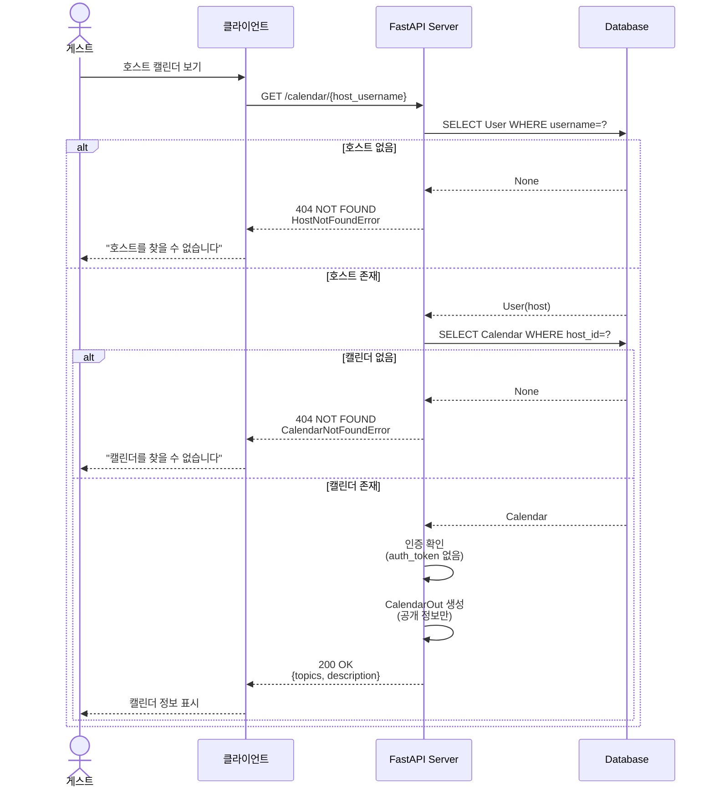
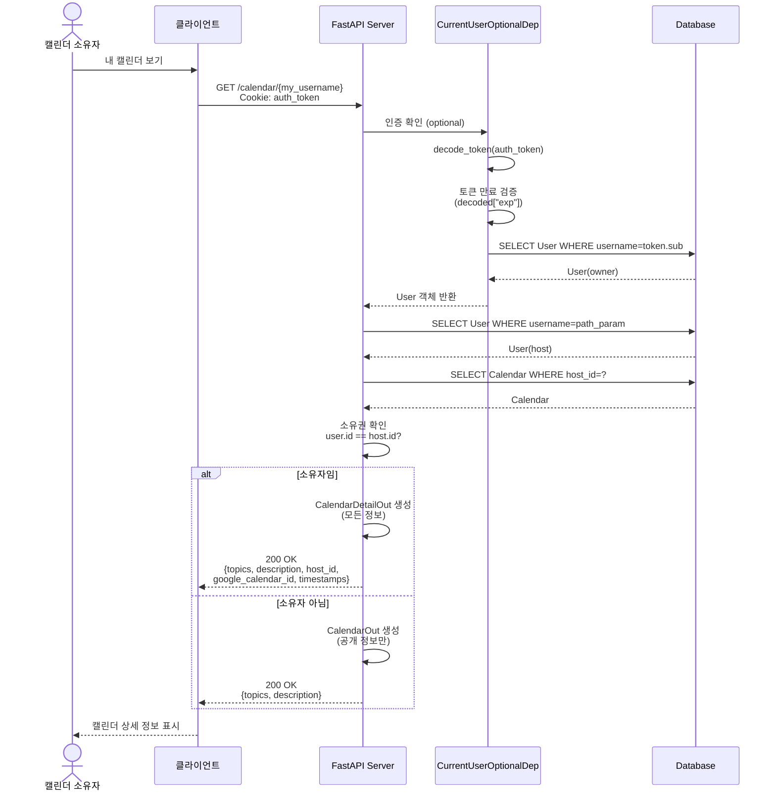
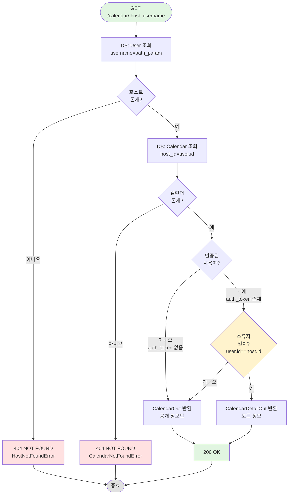

# 캘린더 조회 API 및 인증 버그 수정 문서

## [NOTE] 개요

오늘 작업에서는 두 가지 주요 내용을 구현했습니다:

1. **인증 버그 수정**: JWT 토큰 만료 시간 검증에서 발생한 typo 수정 (`exe` → `exp`)
2. **캘린더 조회 API 구현**: 호스트의 캘린더 정보를 조회하는 `GET /calendar/{host_username}` 엔드포인트 구현
   - 인증 상태에 따라 다른 응답 스키마 반환 (소유자 vs 게스트)
   - 호스트 존재 여부 및 캘린더 존재 여부 검증
   - 포괄적인 테스트 케이스 작성

## [GOAL] 유저 시나리오

### 시나리오 1: 게스트가 호스트의 캘린더 정보 조회 (인증 없음)
**목표**: 비로그인 사용자가 호스트의 공개 캘린더 정보를 조회한다

1. 게스트(비로그인 상태)가 특정 호스트의 캘린더를 보고 싶어합니다
2. 클라이언트가 `GET /calendar/{host_username}` 요청을 보냅니다
3. 서버가 호스트 존재 여부를 확인합니다:
   - 호스트 존재 O
4. 서버가 해당 호스트의 캘린더를 조회합니다:
   - 캘린더 존재 O
5. 서버가 인증 상태를 확인합니다:
   - 인증 토큰 없음 (게스트)
6. 공개 정보만 포함된 `CalendarOut` 응답을 반환합니다
7. 게스트가 호스트의 캘린더 주제와 설명을 볼 수 있습니다

**결과**: HTTP 200 OK
```json
{
  "topics": ["zipsa talk", "zipsa talk2"],
  "description": "zipsa calendar here"
}
```

**노출되지 않는 정보**:
- `google_calendar_id` (구글 캘린더 연동 ID)
- `host_id` (내부 식별자)
- `created_at`, `updated_at` (생성/수정 시간)

---

### 시나리오 2: 캘린더 소유자가 자신의 캘린더 상세 정보 조회
**목표**: 로그인한 호스트가 자신의 캘린더 상세 정보(비공개 정보 포함)를 조회한다

1. 호스트가 로그인된 상태입니다 (auth_token 쿠키 존재)
2. 호스트가 자신의 캘린더를 조회하기 위해 `GET /calendar/{자신의_username}` 요청을 보냅니다
3. 서버가 호스트 존재 여부를 확인합니다:
   - 호스트 존재 O
4. 서버가 캘린더를 조회합니다:
   - 캘린더 존재 O
5. 서버가 인증 상태를 확인합니다:
   - 인증 토큰 유효 O
   - 요청한 사용자 ID == 캘린더 소유자 ID O
6. 모든 정보가 포함된 `CalendarDetailOut` 응답을 반환합니다
7. 호스트가 공개 정보 + 비공개 정보를 모두 볼 수 있습니다

**결과**: HTTP 200 OK
```json
{
  "topics": ["zipsa talk", "zipsa talk2"],
  "description": "zipsa calendar here",
  "host_id": 1,
  "google_calendar_id": "1234567890",
  "created_at": "2026-01-10T00:00:00Z",
  "updated_at": "2026-01-10T00:00:00Z"
}
```

---

### 시나리오 3: 다른 호스트가 타인의 캘린더 조회
**목표**: 로그인한 다른 호스트가 타인의 캘린더를 조회할 때 공개 정보만 본다

1. 호스트 A가 로그인된 상태입니다
2. 호스트 A가 호스트 B의 캘린더를 조회합니다: `GET /calendar/{host_b_username}`
3. 서버가 호스트 B 존재 여부를 확인합니다:
   - 호스트 존재 O
4. 서버가 캘린더를 조회합니다:
   - 캘린더 존재 O
5. 서버가 소유권을 확인합니다:
   - 요청한 사용자 ID != 캘린더 소유자 ID
6. 공개 정보만 포함된 `CalendarOut` 응답을 반환합니다

**결과**: HTTP 200 OK (게스트와 동일한 응답)

---

### 시나리오 4: 존재하지 않는 호스트의 캘린더 조회 시도
**목표**: 존재하지 않는 사용자의 캘린더 조회 시 적절한 에러 반환

1. 클라이언트가 `GET /calendar/nonexistent_user` 요청을 보냅니다
2. 서버가 호스트 존재 여부를 확인합니다:
   - 호스트 존재 X
3. `HostNotFoundError` 예외 발생

**결과**: HTTP 404 NOT FOUND
```json
{
  "detail": "Host Not Founded"
}
```

---

### 시나리오 5: 호스트가 아닌 사용자의 캘린더 조회 시도
**목표**: 게스트 권한 사용자(is_host=False)의 캘린더 조회 시 에러 반환

1. 클라이언트가 게스트 사용자의 username으로 `GET /calendar/{guest_username}` 요청을 보냅니다
2. 서버가 사용자를 찾습니다:
   - 사용자 존재 O
3. 서버가 캘린더를 조회합니다:
   - 캘린더 없음 (게스트는 캘린더를 생성할 수 없음)
4. `CalendarNotFoundError` 예외 발생

**결과**: HTTP 404 NOT FOUND
```json
{
  "detail": "Calendar Not Founded"
}
```

---

## [SECURITY] 보안 사양

### 인증 요구사항
- **선택적 인증**: `CurrentUserOptionalDep` 사용
- **인증 없이도 접근 가능**: 공개 캘린더 정보는 누구나 조회 가능
- **인증 시 추가 정보 제공**: 캘린더 소유자인 경우 상세 정보 제공

### 정보 공개 수준 제어
**공개 정보 (CalendarOut):**
- `topics`: 논의 주제 목록
- `description`: 캘린더 설명

**비공개 정보 (CalendarDetailOut - 소유자만):**
- `host_id`: 내부 호스트 식별자
- `google_calendar_id`: 구글 캘린더 연동 ID
- `created_at`: 생성 시간
- `updated_at`: 최종 수정 시간

### 소유권 검증
```python
if user is not None and user.id == host.id:
    return CalendarDetailOut.model_validate(calendar)
return CalendarOut.model_validate(calendar)
```

### JWT 토큰 만료 검증 버그 수정
**문제**: 토큰 페이로드에서 만료 시간을 가져올 때 잘못된 키 사용
```python
# Before (버그)
expires_at = datetime.fromtimestamp(decoded["exe"], tz=timezone.utc)

# After (수정)
expires_at = datetime.fromtimestamp(decoded["exp"], tz=timezone.utc)
```

**영향**:
- JWT 표준 클레임 `exp` (expiration time)를 `exe`로 잘못 참조
- 토큰 만료 검증 실패 (KeyError 발생 가능)
- 모든 인증이 필요한 엔드포인트에 영향

---

## [DIAGRAM] 시퀀스 다이어그램

### 게스트의 캘린더 조회



### 소유자의 캘린더 조회



---

## [FLOW] 플로우차트



---

## [STRUCTURE] 구현 파일 구조

```
appserver/
├── app.py                          # 라우터 등록 (calendar_router 추가)
└── apps/
    ├── account/
    │   └── deps.py                 # CurrentUserOptionalDep (선택적 인증)
    │                                # 버그 수정: decoded["exe"] → decoded["exp"]
    └── calendar/
        ├── endpoints.py            # GET /calendar/{host_username} 엔드포인트
        ├── schemas.py              # CalendarOut, CalendarDetailOut 스키마
        ├── exceptions.py           # HostNotFoundError, CalendarNotFoundError
        └── models.py               # Calendar 모델 (기존)

tests/
└── apps/
    └── calendar/
        └── test_calendar_api.py    # 캘린더 API 통합 테스트
```

---

## [API] API 명세

### GET /calendar/{host_username}

**설명**: 호스트의 캘린더 정보 조회

**인증**: 선택 (Optional)
- 인증 없음: 공개 정보만 반환 (CalendarOut)
- 인증 + 소유자: 상세 정보 반환 (CalendarDetailOut)

**경로 파라미터**:
| 파라미터 | 타입 | 설명 |
|---------|-----|------|
| `host_username` | string | 호스트의 사용자명 |

**Request (게스트):**
```http
GET /calendar/zipsa1234 HTTP/1.1
```

**Request (소유자):**
```http
GET /calendar/zipsa1234 HTTP/1.1
Cookie: auth_token=eyJhbGciOiJIUzI1NiIsInR5cCI6IkpXVCJ9...
```

**Response (게스트/타인 - CalendarOut):**
```http
HTTP/1.1 200 OK
Content-Type: application/json

{
  "topics": ["zipsa talk", "zipsa talk2"],
  "description": "zipsa calendar here"
}
```

**Response (소유자 - CalendarDetailOut):**
```http
HTTP/1.1 200 OK
Content-Type: application/json

{
  "topics": ["zipsa talk", "zipsa talk2"],
  "description": "zipsa calendar here",
  "host_id": 1,
  "google_calendar_id": "1234567890",
  "created_at": "2026-01-10T00:00:00+00:00",
  "updated_at": "2026-01-10T00:00:00+00:00"
}
```

**에러 응답:**

| 상태 코드 | 에러 | 조건 | 응답 예시 |
|----------|------|------|----------|
| 404 | HostNotFoundError | 호스트 사용자 없음 | `{"detail": "Host Not Founded"}` |
| 404 | CalendarNotFoundError | 캘린더 없음 (게스트 사용자 등) | `{"detail": "Calendar Not Founded"}` |

---

## [TEST] 테스트 커버리지

### 테스트 케이스

#### 캘린더 API 테스트 (test_calendar_api.py)

- [O] `test_get_calendar_info_by_host_username` - 사용자 타입별 캘린더 조회
  - 호스트 소유자: CalendarDetailOut 반환 확인
  - 게스트 사용자: CalendarOut 반환 확인
  - 비로그인 사용자: CalendarOut 반환 확인
  - `@pytest.mark.parametrize`로 3가지 케이스 테스트

- [O] `test_raise_calendar_info_not_found_error_for_nonexistent_user` - 존재하지 않는 사용자 조회 시 404 에러

- [O] `test_raise_calendar_info_not_found_error_for_not_host_user` - 게스트 사용자의 캘린더 조회 시 404 에러

**총 테스트**: 5개 (parametrize로 3개 + 에러 케이스 2개)
**통과율**: 100%

### 테스트 픽스처 (conftest.py)

**추가된 픽스처:**
- `guest_user`: 게스트 권한 사용자 (is_host=False)
- `host_user_calendar`: 호스트의 캘린더 데이터

### 추가 권장 테스트
- [ ] 만료된 토큰으로 캘린더 조회 (401 에러 확인)
- [ ] 유효하지 않은 토큰으로 캘린더 조회
- [ ] 다른 호스트가 타인의 캘린더 조회 시 공개 정보만 반환 확인
- [ ] 캘린더 데이터 필드 검증 (topics 배열, description 문자열 등)

---

## [BUG] 버그 수정 상세

### JWT 토큰 만료 검증 Typo

**파일**: `appserver/apps/account/deps.py:23`

**문제**:
```python
expires_at = datetime.fromtimestamp(decoded["exe"], tz=timezone.utc)
```

**원인**:
- JWT 표준 클레임 이름은 `exp` (expiration time)
- 오타로 인해 `exe`로 잘못 참조
- 실행 시 `KeyError: 'exe'` 발생

**수정**:
```python
expires_at = datetime.fromtimestamp(decoded["exp"], tz=timezone.utc)
```

**영향 범위**:
- 모든 인증이 필요한 엔드포인트
- `CurrentUserDep`, `CurrentUserOptionalDep` 사용하는 모든 API

**관련 커밋**:
- `64475de` - fix(auth): correct typo in token expiration validation

---

## [NEXT] 다음 단계

### 캘린더 기능 확장
1. [ ] 캘린더 생성 API (`POST /calendar`)
2. [ ] 캘린더 수정 API (`PATCH /calendar`)
3. [ ] 캘린더 삭제 API (`DELETE /calendar`)
4. [ ] 타임슬롯 관리 API

### 구글 캘린더 연동
5. [ ] OAuth 2.0 구글 인증 플로우
6. [ ] 구글 캘린더 동기화 기능
7. [ ] 양방향 이벤트 동기화

### 테스트 보강
8. [ ] 만료 토큰 테스트 케이스
9. [ ] 캘린더 데이터 필드 검증 테스트
10. [ ] 엣지 케이스 테스트 (빈 topics, 긴 description 등)

### 보안 강화
11. [ ] Rate limiting (API 호출 제한)
12. [ ] CORS 설정
13. [ ] google_calendar_id 암호화 저장

---

## 주요 코드 스니펫

### 캘린더 조회 엔드포인트
```python
# appserver/apps/calendar/endpoints.py:13-35
@router.get("/calendar/{host_username}", status_code=status.HTTP_200_OK)
async def host_calendar_detail(
        host_username: str,
        user: CurrentUserOptionalDep,
        session: DbSessionDep
) -> CalendarOut | CalendarDetailOut:

    # 호스트 존재 확인
    stmt = select(User).where(User.username == host_username)
    result = await session.execute(stmt)
    host = result.scalar_one_or_none()
    if host is None:
        raise HostNotFoundError()

    # 캘린더 존재 확인
    stmt = select(Calendar).where(Calendar.host_id == host.id)
    result = await session.execute(stmt)
    calendar = result.scalar_one_or_none()
    if calendar is None:
        raise CalendarNotFoundError()

    # 소유권 확인 및 응답 분기
    if user is not None and user.id == host.id:
        return CalendarDetailOut.model_validate(calendar)

    return CalendarOut.model_validate(calendar)
```

### 응답 스키마
```python
# appserver/apps/calendar/schemas.py:5-14
class CalendarOut(SQLModel):
    topics: list[str]
    description: str


class CalendarDetailOut(CalendarOut):
    host_id: int
    google_calendar_id: str
    created_at: AwareDatetime
    updated_at: AwareDatetime
```

### 커스텀 예외
```python
# appserver/apps/calendar/exceptions.py:4-17
class HostNotFoundError(HTTPException):
    def __init__(self):
        super().__init__(
            status_code=status.HTTP_404_NOT_FOUND,
            detail="Host Not Founded"
        )


class CalendarNotFoundError(HTTPException):
    def __init__(self):
        super().__init__(
            status_code=status.HTTP_404_NOT_FOUND,
            detail="Calendar Not Founded"
        )
```

### 선택적 인증 의존성
```python
# appserver/apps/account/deps.py:49-57
async def get_current_user_optional(
        db_session: DbSessionDep,
        auth_token: Annotated[str | None, Cookie()] = None
        ):
    user = await get_user(auth_token, db_session)
    return user


CurrentUserOptionalDep = Annotated[User | None, Depends(get_current_user_optional)]
```

### 파라미터화된 테스트
```python
# tests/apps/calendar/test_calendar_api.py:11-41
@pytest.mark.parametrize("user_key, expected_type", [
    ("host_user", CalendarDetailOut),
    ("guest_user", CalendarOut),
    (None, CalendarOut),
])
async def test_get_calendar_info_by_host_username(
    user_key: str | None,
    expected_type: type[CalendarOut | CalendarDetailOut],
    host_user: User,
    host_user_calendar: Calendar,
    client: TestClient,
    client_with_auth: TestClient,
) -> CalendarOut | CalendarDetailOut:
    clients = {
        "host_user": client_with_auth,
        "guest_user": client,
        None: client,
    }
    user_client = clients[user_key]

    response = user_client.get(f"/calendar/{host_user.username}")
    result = response.json()
    assert response.status_code == status.HTTP_200_OK

    expected_obj = expected_type.model_validate(result)

    assert expected_obj.topics == host_user_calendar.topics
    assert expected_obj.description == host_user_calendar.description
    if isinstance(expected_obj, CalendarDetailOut):
        assert expected_obj.google_calendar_id == host_user_calendar.google_calendar_id
```

### 라우터 등록
```python
# appserver/app.py:7-9
def include_routers(_app: FastAPI):
    _app.include_router(account_router)
    _app.include_router(calendar_router)  # 추가됨
```

---

## 아키텍처 노트

### 선택적 인증 패턴
- **CurrentUserOptionalDep**: 인증이 선택적인 엔드포인트에 사용
- **유연한 응답**: 인증 상태에 따라 다른 데이터 반환
- **보안**: 민감 정보는 소유자에게만 노출

### 응답 스키마 상속
```python
CalendarOut (공개)
    ↓ 상속
CalendarDetailOut (비공개)
```
- **CalendarOut**: 기본 공개 정보
- **CalendarDetailOut**: CalendarOut + 추가 비공개 정보
- Pydantic 상속으로 코드 중복 제거

### 에러 처리 계층
1. **호스트 검증**: HostNotFoundError (사용자 없음)
2. **캘린더 검증**: CalendarNotFoundError (캘린더 없음)
3. **권한 검증**: 소유권 확인 후 응답 분기

### RESTful 설계
- **리소스 중심**: `/calendar/{host_username}`
- **HTTP 메서드**: GET (조회)
- **상태 코드**: 200 OK (성공), 404 NOT FOUND (리소스 없음)
- **명확한 에러 메시지**: detail 필드에 구체적인 오류 설명

---

## 커밋 정보

### 오늘의 커밋 (2026-01-10)

1. **64475de** - `fix(auth): correct typo in token expiration validation`
   - JWT 토큰 만료 검증 typo 수정 (exe → exp)
   - 파일: `appserver/apps/account/deps.py`

2. **14fbd2e** - `feat(calendar): add router decorator to host calendar detail endpoint`
   - 캘린더 조회 엔드포인트 구현
   - 파일: `appserver/apps/calendar/endpoints.py`

3. **ebdde4a** - `feat(calendar): register calendar router in main app`
   - 메인 앱에 캘린더 라우터 등록
   - 파일: `appserver/app.py`

4. **7bf33f2** - `test(calendar): add API integration tests for calendar endpoints`
   - 캘린더 API 통합 테스트 추가
   - 파일: `tests/apps/calendar/test_calendar_api.py`

**총 변경 파일**: 4개
**총 라인 추가**: ~150 lines
**총 라인 삭제**: ~2 lines

---

## 관련 API

### 인증 플로우와 캘린더 조회
```
POST /account/login
  → 로그인 성공
  → auth_token 쿠키 설정
  → 인증된 상태

GET /calendar/{host_username}
  → 인증 상태 확인 (optional)
  → 소유자: 상세 정보 반환
  → 게스트/비로그인: 공개 정보만 반환
```

### 향후 캘린더 관리 API
```
POST /calendar
  → 캘린더 생성 (호스트만)

PATCH /calendar
  → 캘린더 수정 (소유자만)

DELETE /calendar
  → 캘린더 삭제 (소유자만)

GET /calendar/{host_username}/timeslots
  → 예약 가능한 시간대 조회

POST /calendar/{host_username}/bookings
  → 커피챗 예약 (게스트)
```

---

## 학습 포인트

### 1. 선택적 의존성 주입
FastAPI에서 선택적 인증을 구현하는 방법:
```python
async def get_current_user_optional(
    auth_token: Annotated[str | None, Cookie()] = None
):
    if auth_token is None:
        return None
    # 토큰 검증 로직...
```

### 2. Union 반환 타입
엔드포인트에서 조건부로 다른 타입 반환:
```python
async def endpoint() -> CalendarOut | CalendarDetailOut:
    if condition:
        return CalendarDetailOut(...)
    return CalendarOut(...)
```

### 3. Pydantic 스키마 상속
코드 중복 제거를 위한 스키마 상속:
```python
class BaseSchema(SQLModel):
    common_field: str

class DetailSchema(BaseSchema):
    additional_field: int
```

### 4. Pytest Parametrize
하나의 테스트로 여러 케이스 검증:
```python
@pytest.mark.parametrize("input,expected", [
    (case1, result1),
    (case2, result2),
])
def test_function(input, expected):
    assert function(input) == expected
```

### 5. JWT 표준 클레임
- `sub` (subject): 사용자 식별자
- `exp` (expiration): 만료 시간 (Unix timestamp)
- `iat` (issued at): 발급 시간
- `iss` (issuer): 발급자

---

*작성일: 2026-01-10*
*작성자: Development Team*
*관련 커밋: 64475de, 14fbd2e, ebdde4a, 7bf33f2*
