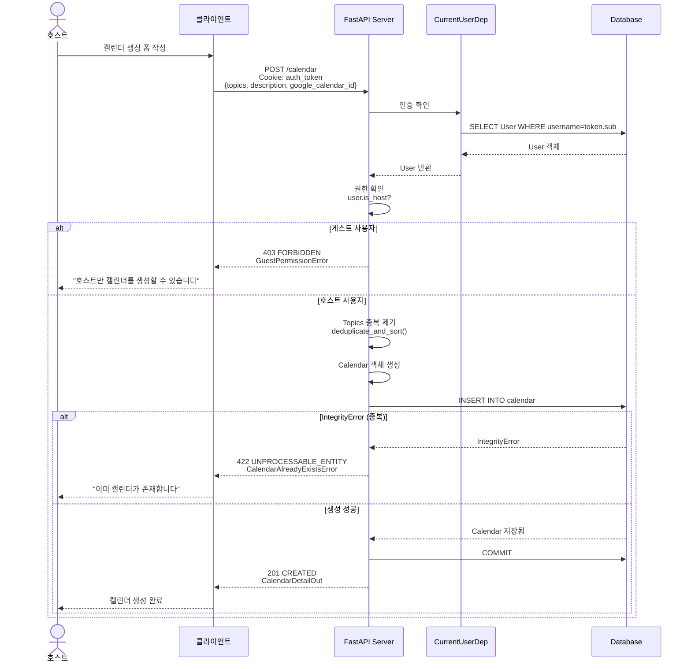
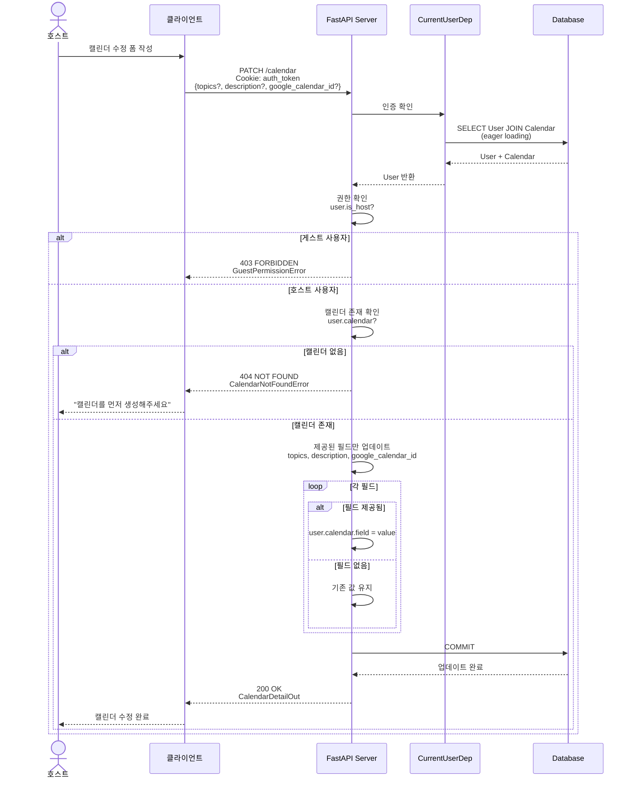
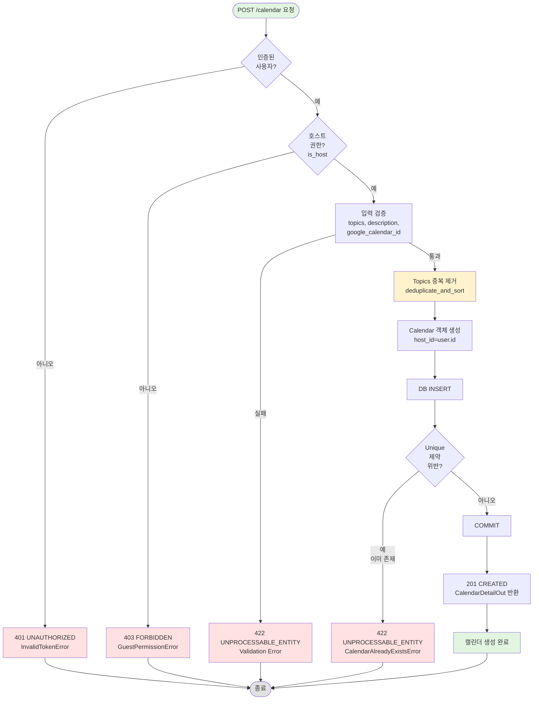
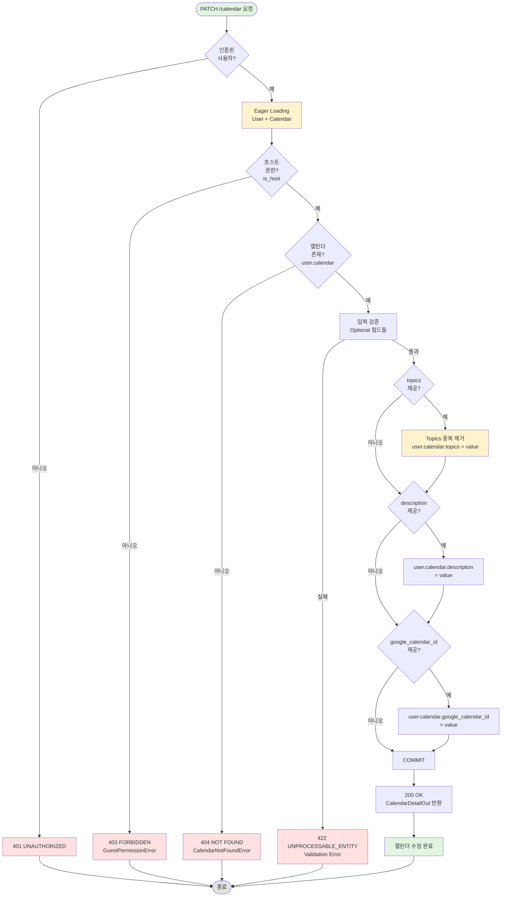

# 캘린더 생성 및 수정 API 구현 문서

## [NOTE] 개요

호스트가 자신의 캘린더를 생성하고 수정할 수 있는 API를 구현했습니다:
- `POST /calendar`: 캘린더 생성 (호스트 전용)
- `PATCH /calendar`: 캘린더 부분 수정 (호스트 전용)

주요 기능:
- Topics 자동 중복 제거 및 삽입 순서 유지
- 호스트 권한 검증 (게스트는 캘린더 생성/수정 불가)
- 부분 업데이트 지원 (PATCH 의미론 준수)
- Eager loading을 통한 N+1 쿼리 방지
- 통일된 검증 규칙 (description 최소 10자)

---

## [GOAL] 유저 시나리오

### 시나리오 1: 호스트가 캘린더 생성
**목표**: 로그인한 호스트가 자신의 커피챗 캘린더를 생성한다

1. 호스트가 로그인된 상태입니다 (auth_token 쿠키 존재, is_host=True)
2. 호스트가 캘린더 생성 폼을 작성합니다:
   - Topics: ["coffee", "career", "coffee"] (중복 포함)
   - Description: "Let's talk about career and tech"
   - Google Calendar ID: "mycalendar@group.calendar.google.com"
3. 클라이언트가 `POST /calendar` 요청을 보냅니다
4. 서버가 호스트 권한을 확인합니다:
   - 인증된 사용자 O
   - is_host=True O
5. 서버가 Topics 중복을 제거합니다:
   - ["coffee", "career", "coffee"] → ["coffee", "career"]
6. 서버가 캘린더를 생성하고 DB에 저장합니다
7. 서버가 201 Created와 함께 캘린더 상세 정보를 반환합니다

**결과**: HTTP 201 CREATED
```json
{
  "topics": ["coffee", "career"],
  "description": "Let's talk about career and tech",
  "google_calendar_id": "mycalendar@group.calendar.google.com",
  "host_id": 1,
  "created_at": "2026-01-10T00:00:00+00:00",
  "updated_at": "2026-01-10T00:00:00+00:00"
}
```

---

### 시나리오 2: 게스트가 캘린더 생성 시도
**목표**: 게스트 권한 사용자의 캘린더 생성을 차단한다

1. 게스트가 로그인된 상태입니다 (is_host=False)
2. 게스트가 `POST /calendar` 요청을 시도합니다
3. 서버가 호스트 권한을 확인합니다:
   - 인증된 사용자 O
   - is_host=False X
4. GuestPermissionError 발생

**결과**: HTTP 403 FORBIDDEN
```json
{
  "detail": "Guests cannot Create Calendars"
}
```

---

### 시나리오 3: 이미 캘린더가 있는 호스트가 재생성 시도
**목표**: 호스트당 하나의 캘린더만 생성 가능하도록 제한한다

1. 호스트가 이미 캘린더를 생성한 상태입니다
2. 호스트가 다시 `POST /calendar` 요청을 보냅니다
3. 서버가 캘린더 생성을 시도합니다
4. DB IntegrityError 발생 (host_id unique 제약 위반)
5. CalendarAlreadyExistsError 발생

**결과**: HTTP 422 UNPROCESSABLE_ENTITY
```json
{
  "detail": "Calendar Already Exists"
}
```

---

### 시나리오 4: 호스트가 캘린더 정보 부분 수정
**목표**: 호스트가 자신의 캘린더 일부 필드만 수정한다

1. 호스트가 캘린더를 이미 생성한 상태입니다:
   - Topics: ["coffee", "career"]
   - Description: "Let's talk about career and tech"
   - Google Calendar ID: "old@group.calendar.google.com"
2. 호스트가 description과 topics만 수정하려 합니다
3. 클라이언트가 `PATCH /calendar` 요청을 보냅니다:
   ```json
   {
     "description": "New description with more details",
     "topics": ["startup", "ai", "startup"]
   }
   ```
4. 서버가 호스트 권한을 확인합니다
5. 서버가 user.calendar가 존재하는지 확인합니다 (eager loading)
6. 서버가 제공된 필드만 업데이트합니다:
   - topics: ["startup", "ai"] (중복 제거)
   - description: "New description with more details"
   - google_calendar_id: "old@group.calendar.google.com" (변경 없음)
7. 서버가 200 OK와 함께 업데이트된 정보를 반환합니다

**결과**: HTTP 200 OK
```json
{
  "topics": ["startup", "ai"],
  "description": "New description with more details",
  "google_calendar_id": "old@group.calendar.google.com",
  "host_id": 1,
  "created_at": "2026-01-10T00:00:00+00:00",
  "updated_at": "2026-01-10T02:30:00+00:00"
}
```

---

### 시나리오 5: 게스트가 캘린더 수정 시도
**목표**: 게스트 권한 사용자의 캘린더 수정을 차단한다

1. 게스트가 로그인된 상태입니다 (is_host=False)
2. 게스트가 `PATCH /calendar` 요청을 시도합니다
3. 서버가 호스트 권한을 확인합니다:
   - 인증된 사용자 O
   - is_host=False X
4. GuestPermissionError 발생

**결과**: HTTP 403 FORBIDDEN
```json
{
  "detail": "Guests cannot Create Calendars"
}
```

---

### 시나리오 6: 캘린더가 없는 호스트가 수정 시도
**목표**: 캘린더를 생성하지 않은 호스트의 수정 시도를 차단한다

1. 호스트가 로그인된 상태이지만 캘린더를 생성하지 않았습니다
2. 호스트가 `PATCH /calendar` 요청을 시도합니다
3. 서버가 user.calendar를 확인합니다:
   - user.calendar is None
4. CalendarNotFoundError 발생

**결과**: HTTP 404 NOT FOUND
```json
{
  "detail": "Calendar Not Founded"
}
```

---

## [SECURITY] 보안 사양

### 인증 요구사항
- **필수**: JWT 토큰 (HTTP-only 쿠키)
- **검증**: CurrentUserDep dependency를 통한 자동 검증
- **권한**: 호스트만 캘린더 생성/수정 가능 (is_host=True)

### 권한 검증
```python
if not user.is_host:
    raise GuestPermissionError()  # 403 FORBIDDEN
```

### 소유권 검증
- 캘린더는 호스트당 하나만 생성 가능 (DB unique 제약)
- 수정 시 자신의 캘린더만 수정 가능 (user.calendar 접근)

### 입력 검증

**Topics:**
- 타입: `list[str]`
- 최소 개수: 1개 (`min_length=1`)
- 자동 처리: 중복 제거 및 삽입 순서 유지 (AfterValidator)

**Description:**
- 타입: `str`
- 최소 길이: 10자 (`min_length=10`)
- 생성/수정 시 동일한 제약 조건

**Google Calendar ID:**
- 타입: `EmailStr`
- 형식: 이메일 주소 형식 검증
- 예시: "user@example.com", "calendar@group.calendar.google.com"

### 데이터 무결성
- **IntegrityError 처리**: 중복 캘린더 생성 시 422 에러
- **Unique 제약**: host_id에 unique 제약으로 중복 방지
- **Transaction 보장**: commit 전까지 변경사항 롤백 가능

---

## [DIAGRAM] 시퀀스 다이어그램

### 캘린더 생성 (POST /calendar)



### 캘린더 수정 (PATCH /calendar)



---

## [FLOW] 플로우차트

### POST /calendar 생성 플로우



### PATCH /calendar 수정 플로우



---

## [STRUCTURE] 구현 파일 구조

```
appserver/
├── apps/
│   ├── account/
│   │   └── models.py              # User.calendar relationship (lazy='joined' 추가)
│   └── calendar/
│       ├── endpoints.py           # POST /calendar, PATCH /calendar 엔드포인트
│       ├── schemas.py             # CalendarCreateIn, CalendarUpdateIn 스키마
│       ├── exceptions.py          # CalendarAlreadyExistsError, GuestPermissionError
│       └── models.py              # Calendar 모델 (기존)
└── libs/
    └── collections/
        └── sort.py                # deduplicate_and_sort 유틸리티 함수

tests/
├── conftest.py                    # client_with_guest_auth 픽스처 추가
└── apps/calendar/
    └── test_calendar_api.py       # 생성/수정 API 통합 테스트
```

---

## [API] API 명세

### POST /calendar - 캘린더 생성

**설명**: 호스트가 자신의 캘린더를 생성합니다.

**인증**: 필수 (CurrentUserDep)
**권한**: 호스트만 가능 (is_host=True)

**Request:**
```http
POST /calendar HTTP/1.1
Cookie: auth_token=eyJhbGciOiJIUzI1NiIsInR5cCI6IkpXVCJ9...
Content-Type: application/json

{
  "topics": ["coffee", "career", "coffee"],
  "description": "Let's talk about career and tech",
  "google_calendar_id": "mycalendar@group.calendar.google.com"
}
```

**Request Body:**
| 필드 | 타입 | 필수 | 제약 | 설명 |
|-----|------|------|------|------|
| topics | list[str] | ✅ | min_length=1 | 논의 주제 목록 (중복 자동 제거) |
| description | str | ✅ | min_length=10 | 캘린더 설명 |
| google_calendar_id | EmailStr | ✅ | 이메일 형식 | 구글 캘린더 ID |

**Response (성공 - 201 CREATED):**
```json
{
  "topics": ["coffee", "career"],
  "description": "Let's talk about career and tech",
  "google_calendar_id": "mycalendar@group.calendar.google.com",
  "host_id": 1,
  "created_at": "2026-01-10T00:00:00+00:00",
  "updated_at": "2026-01-10T00:00:00+00:00"
}
```

**에러 응답:**

| 상태 코드 | 에러 | 조건 | 응답 예시 |
|----------|------|------|----------|
| 401 | Unauthorized | 인증 토큰 없음/만료 | `{"detail": "Invalid token"}` |
| 403 | GuestPermissionError | 게스트 사용자 (is_host=False) | `{"detail": "Guests cannot Create Calendars"}` |
| 422 | ValidationError | 입력 검증 실패 (description < 10자 등) | `{"detail": [{"type": "string_too_short", ...}]}` |
| 422 | CalendarAlreadyExistsError | 이미 캘린더 존재 | `{"detail": "Calendar Already Exists"}` |

---

### PATCH /calendar - 캘린더 수정

**설명**: 호스트가 자신의 캘린더 정보를 부분 수정합니다.

**인증**: 필수 (CurrentUserDep)
**권한**: 호스트만 가능 (is_host=True)
**특징**: 부분 업데이트 지원 (제공된 필드만 수정)

**Request:**
```http
PATCH /calendar HTTP/1.1
Cookie: auth_token=eyJhbGciOiJIUzI1NiIsInR5cCI6IkpXVCJ9...
Content-Type: application/json

{
  "description": "New description with more details",
  "topics": ["startup", "ai", "startup"]
}
```

**Request Body (모든 필드 Optional):**
| 필드 | 타입 | 필수 | 제약 | 설명 |
|-----|------|------|------|------|
| topics | list[str] \| null | ❌ | min_length=1 | 논의 주제 목록 (중복 자동 제거) |
| description | str \| null | ❌ | min_length=10 | 캘린더 설명 |
| google_calendar_id | EmailStr \| null | ❌ | 이메일 형식 | 구글 캘린더 ID |

**Response (성공 - 200 OK):**
```json
{
  "topics": ["startup", "ai"],
  "description": "New description with more details",
  "google_calendar_id": "old@group.calendar.google.com",
  "host_id": 1,
  "created_at": "2026-01-10T00:00:00+00:00",
  "updated_at": "2026-01-10T02:30:00+00:00"
}
```

**에러 응답:**

| 상태 코드 | 에러 | 조건 | 응답 예시 |
|----------|------|------|----------|
| 401 | Unauthorized | 인증 토큰 없음/만료 | `{"detail": "Invalid token"}` |
| 403 | GuestPermissionError | 게스트 사용자 (is_host=False) | `{"detail": "Guests cannot Create Calendars"}` |
| 404 | CalendarNotFoundError | 캘린더 미생성 상태 | `{"detail": "Calendar Not Founded"}` |
| 422 | ValidationError | 입력 검증 실패 | `{"detail": [{"type": "string_too_short", ...}]}` |

---

## [TEST] 테스트 커버리지

### POST /calendar 생성 테스트

- [O] `test_host_user_can_create_calendar_with_valid_information`
  - 호스트가 유효한 정보로 캘린더 생성 성공
  - Topics 중복 제거 검증 (["topic2", "topic1", "topic2"] → ["topic2", "topic1"])
  - 201 Created 상태 코드 확인
  - 반환된 데이터 검증 (host_id, topics, description, google_calendar_id)

- [O] `test_returns_422_when_calendar_already_exists`
  - 같은 호스트가 캘린더 재생성 시도
  - 첫 번째 생성: 201 Created
  - 두 번째 생성 시도: 422 Unprocessable Entity

- [O] `test_returns_403_when_guest_user_create_calendar`
  - 게스트 사용자(is_host=False)가 캘린더 생성 시도
  - 403 Forbidden 상태 코드 확인

### PATCH /calendar 수정 테스트

- [O] `test_only_update_values_by_user_changed[payload0]`
  - 단일 필드 업데이트: topics만 수정
  - 수정된 필드: topics
  - 유지된 필드: description, google_calendar_id

- [O] `test_only_update_values_by_user_changed[payload1]`
  - 단일 필드 업데이트: description만 수정
  - 수정된 필드: description
  - 유지된 필드: topics, google_calendar_id

- [O] `test_only_update_values_by_user_changed[payload2]`
  - 단일 필드 업데이트: google_calendar_id만 수정
  - 수정된 필드: google_calendar_id
  - 유지된 필드: topics, description

- [O] `test_only_update_values_by_user_changed[payload3]`
  - 전체 필드 업데이트: 모든 필드 동시 수정
  - 수정된 필드: topics, description, google_calendar_id

### 테스트 통계

**총 테스트**: 7개 (생성 3개 + 수정 4개)
**통과율**: 100%
**커버리지**: 주요 시나리오 및 에러 케이스

### 추가 권장 테스트

- [ ] 인증 없이 생성/수정 시도 (401 에러)
- [ ] 만료된 토큰으로 생성/수정 시도 (401 에러)
- [ ] description 9자 이하로 생성 시도 (422 에러)
- [ ] 빈 topics 배열로 생성 시도 (422 에러)
- [ ] 잘못된 이메일 형식으로 생성 시도 (422 에러)
- [ ] 모든 필드가 None인 PATCH 요청 (현재는 200 OK)

---

## [NEXT] 다음 단계

### 기능 개선
1. [ ] 빈 업데이트 방지: 모든 필드가 None인 PATCH 요청 거부
2. [ ] 캘린더 삭제 API: `DELETE /calendar` 구현
3. [ ] 캘린더 목록 조회: `GET /calendars` (전체 호스트 목록)
4. [ ] 타임슬롯 관리: 예약 가능한 시간대 설정

### 검증 강화
5. [ ] Topics 내 각 항목 최소/최대 길이 제한
6. [ ] Description 최대 길이 제한 (현재는 최소만)
7. [ ] Topics 최대 개수 제한 (예: 10개)

### 성능 최적화
8. [ ] Lazy loading 전략 재검토 (모든 User 조회 시 Calendar JOIN 필요한지)
9. [ ] 선택적 Eager loading: `selectinload()` 사용 고려

### 보안 강화
10. [ ] Rate limiting 추가
11. [ ] XSS 방지: 입력 sanitization
12. [ ] CORS 설정

---

## 주요 코드 스니펫

### 1. Topics 중복 제거 유틸리티

```python
# appserver/libs/collections/sort.py
def deduplicate_and_sort(items: list[str]) -> list[str]:
    """
    remove duplicated List values and sort them

    >>> items = ["b", "a", "b", "a", "c", "b"]
    >>> result = deduplicate_and_sort(items)
    >>> assert result == ["b", "a", "c"]
    """
    return list(dict.fromkeys(items))
```

**동작 원리:**
- `dict.fromkeys(items)`: 딕셔너리는 키 중복을 허용하지 않으므로 중복 제거
- 삽입 순서 유지: Python 3.7+ 딕셔너리는 삽입 순서 보장
- `list()`: 다시 리스트로 변환

### 2. Topics 타입 정의

```python
# appserver/apps/calendar/schemas.py
from typing import Annotated
from pydantic import AfterValidator

Topics = Annotated[list[str], AfterValidator(deduplicate_and_sort)]
```

**Pydantic AfterValidator:**
- 입력 검증 후 자동으로 `deduplicate_and_sort` 실행
- 사용자가 중복된 topics를 보내도 자동으로 정리됨

### 3. CalendarCreateIn 스키마

```python
# appserver/apps/calendar/schemas.py
class CalendarCreateIn(SQLModel):
    topics: Topics = Field(min_length=1, description="Topics to share with guests")
    description: str = Field(min_length=10, description="Description shown to guests")
    google_calendar_id: EmailStr = Field(description="Google Calendar ID")
```

**검증 규칙:**
- `topics`: 최소 1개 이상, 자동 중복 제거
- `description`: 최소 10자 이상
- `google_calendar_id`: 이메일 형식

### 4. CalendarUpdateIn 스키마

```python
# appserver/apps/calendar/schemas.py
class CalendarUpdateIn(SQLModel):
    topics: Topics | None = Field(
        default=None,
        min_length=1,
        description="Topics to share with guests",
    )
    description: str | None = Field(
        default=None,
        min_length=10,
        description="Description shown to guests")
    google_calendar_id: EmailStr | None = Field(
        default=None,
        min_length=20,
        description="Google Calendar ID",
    )
```

**특징:**
- 모든 필드 Optional (None 허용)
- 제공된 필드만 업데이트
- 검증 규칙은 생성 시와 동일

### 5. POST /calendar 엔드포인트

```python
# appserver/apps/calendar/endpoints.py:39-62
@router.post(
    "/calendar",
    status_code=status.HTTP_201_CREATED,
    response_model=CalendarDetailOut,
)
async def create_calendar(
    user: CurrentUserDep,
    session: DbSessionDep,
    payload: CalendarCreateIn
) -> CalendarDetailOut:
    if not user.is_host:
        raise GuestPermissionError()

    calendar = Calendar(
        host_id=user.id,
        topics=payload.topics,
        description=payload.description,
        google_calendar_id=payload.google_calendar_id,
    )
    session.add(calendar)
    try:
        await session.commit()
    except IntegrityError as exc:
        raise CalendarAlreadyExistsError() from exc

    return calendar
```

**주요 로직:**
1. 호스트 권한 확인 (`user.is_host`)
2. Calendar 객체 생성 (topics는 자동 중복 제거됨)
3. DB 저장 시도
4. IntegrityError 발생 시 CalendarAlreadyExistsError로 변환
5. 성공 시 생성된 calendar 반환

### 6. PATCH /calendar 엔드포인트

```python
# appserver/apps/calendar/endpoints.py:65-92
@router.patch(
    "/calendar",
    status_code=status.HTTP_200_OK,
    response_model=CalendarDetailOut,
)
async def update_calendar(
    user: CurrentUserDep,
    session: DbSessionDep,
    payload: CalendarUpdateIn
) -> CalendarDetailOut:
    if not user.is_host:
        raise GuestPermissionError()

    if user.calendar is None:
        raise CalendarNotFoundError()

    if payload.topics is not None:
        user.calendar.topics = payload.topics

    if payload.description is not None:
        user.calendar.description = payload.description

    if payload.google_calendar_id is not None:
        user.calendar.google_calendar_id = payload.google_calendar_id

    await session.commit()

    return user.calendar
```

**주요 로직:**
1. 호스트 권한 확인
2. 캘린더 존재 확인 (`user.calendar` 접근 - eager loading)
3. 제공된 필드만 업데이트 (None이 아닌 것만)
4. DB 커밋
5. 업데이트된 calendar 반환

### 7. Eager Loading 설정

```python
# appserver/apps/account/models.py:30-34
calendar: Union["Calendar", None] = Relationship(
    back_populates="host",
    sa_relationship_kwargs={
        "uselist": False,
        "single_parent": True,
        "lazy": "joined"  # ← 추가됨
    },
)
```

**lazy='joined' 효과:**
- User 조회 시 Calendar를 JOIN으로 함께 로드
- `user.calendar` 접근 시 추가 쿼리 발생하지 않음
- N+1 쿼리 문제 방지

**생성되는 SQL:**
```sql
SELECT users.*, calendar.*
FROM users
LEFT JOIN calendar ON calendar.host_id = users.id
WHERE users.username = ?
```

### 8. 커스텀 예외

```python
# appserver/apps/calendar/exceptions.py
class CalendarAlreadyExistsError(HTTPException):
    def __init__(self):
        super().__init__(
            status_code=status.HTTP_422_UNPROCESSABLE_ENTITY,
            detail="Calendar Already Exists"
        )


class GuestPermissionError(HTTPException):
    def __init__(self):
        super().__init__(
            status_code=status.HTTP_403_FORBIDDEN,
            detail="Guests cannot Create Calendars"
        )
```

### 9. Parametrized 테스트

```python
# tests/apps/calendar/test_calendar_api.py:111-141
UPDATABLE_FIELDS = frozenset(["topics", "description", "google_calendar_id"])

@pytest.mark.parametrize("payload", [
    {"topics": ["topic2", "topic1", "topic2"]},
    {"description": "Description text length over 10"},
    {"google_calendar_id": "invalid_google_calendar_id@group.calendar.google.com"},
    {"topics": ["topic2", "topic1", "topic2"],
     "description": "Description text length over 10",
     "google_calendar_id": "invalid_google_calendar_id@group.calendar.google.com"}
])
async def test_only_update_values_by_user_changed(
    client_with_auth: TestClient,
    host_user_calendar: Calendar,
    payload: dict,
) -> None:
    before_data = host_user_calendar.model_dump()

    response = client_with_auth.patch("/calendar", json=payload)
    assert response.status_code == status.HTTP_200_OK

    response = client_with_auth.get(f"/calendar/{host_user_calendar.host.username}")
    data = response.json()

    # 수정된 필드 검증
    for key, value in payload.items():
        if key == "topics":
            assert data[key] == deduplicate_and_sort(value)
        else:
            assert data[key] == value

    # 수정되지 않은 필드는 그대로 유지
    for key in UPDATABLE_FIELDS - frozenset(payload.keys()):
        assert data[key] == before_data[key]
```

**테스트 전략:**
- 4가지 payload 조합 테스트 (단일 필드 3개 + 전체 필드)
- 수정된 필드: 새 값 반영 확인
- 수정되지 않은 필드: 기존 값 유지 확인
- Topics: 중복 제거 검증

---

## 아키텍처 노트

### 1. Eager Loading vs Lazy Loading

**선택한 방식: Eager Loading (lazy='joined')**

**장점:**
- N+1 쿼리 방지
- `user.calendar` 접근 시 추가 DB 쿼리 없음
- update_calendar 엔드포인트에서 필수

**단점:**
- User만 필요한 경우에도 Calendar 데이터 로드
- JOIN 비용 증가

**대안:**
```python
# 필요한 경우에만 명시적으로 로드
from sqlalchemy.orm import selectinload

stmt = select(User).options(selectinload(User.calendar))
```

### 2. 부분 업데이트 패턴

**PATCH 의미론 준수:**
- 제공된 필드만 업데이트
- 제공하지 않은 필드는 그대로 유지
- PUT(전체 교체)과 구별

**구현 방식:**
```python
if payload.field is not None:
    user.calendar.field = payload.field
```

**Pydantic 활용:**
```python
class CalendarUpdateIn(SQLModel):
    field: str | None = Field(default=None)  # Optional
```

### 3. Topics 중복 제거 전략

**dict.fromkeys() 사용 이유:**
- Python 3.7+ 딕셔너리는 삽입 순서 보장
- set()은 순서를 보장하지 않음
- 간단하고 효율적

**대안:**
```python
# set 사용 (순서 보장 안 됨)
list(set(items))

# OrderedDict 사용 (명시적)
from collections import OrderedDict
list(OrderedDict.fromkeys(items))
```

### 4. IntegrityError 처리

**DB 제약 조건 활용:**
```python
# Calendar 모델
host_id: int = Field(foreign_key="users.id", unique=True)
```

**Python에서 처리:**
```python
try:
    await session.commit()
except IntegrityError:
    raise CalendarAlreadyExistsError()
```

**장점:**
- DB 레벨에서 데이터 무결성 보장
- Race condition 방지
- 일관성 있는 에러 메시지

### 5. 검증 규칙 통일의 중요성

**문제 상황 (수정 전):**
```python
# 생성: min_length=1
# 수정: min_length=10
# → 1~9자 설명을 가진 캘린더는 수정 불가!
```

**해결 (수정 후):**
```python
# 생성: min_length=10
# 수정: min_length=10
# → 일관성 확보, 기존 데이터 수정 가능
```

**교훈:**
- CREATE ≤ UPDATE 제약 조건
- 생성 시부터 데이터 품질 확보
- 수정 시 최소한 기존 값 유지 가능해야 함

---

## 커밋 정보

### 오늘의 커밋 (2026-01-10)

```
0900c32 feat(calendar): implement PATCH /calendar endpoint for calendar updates
663f652 refactor(tests): remove unused import from calendar tests
5372842 test(calendar): add comprehensive tests for POST /calendar endpoint
5261e56 feat(calendar): implement POST /calendar endpoint for calendar creation
a3f02ac feat(calendar): add schemas and utilities for calendar creation
```

### 커밋 상세

**1. a3f02ac - 스키마 및 유틸리티**
- `appserver/libs/collections/sort.py` 생성
- `CalendarCreateIn` 스키마 추가
- `CalendarAlreadyExistsError`, `GuestPermissionError` 예외 추가

**2. 5261e56 - 생성 엔드포인트**
- `POST /calendar` 엔드포인트 구현
- 호스트 권한 검증
- IntegrityError 처리

**3. 5372842 - 생성 테스트**
- 생성 성공 테스트
- 중복 생성 테스트 (422)
- 게스트 권한 테스트 (403)
- `client_with_guest_auth` 픽스처 추가

**4. 663f652 - 코드 정리**
- 불필요한 import 제거

**5. 0900c32 - 수정 엔드포인트**
- `PATCH /calendar` 엔드포인트 구현
- `CalendarUpdateIn` 스키마 추가
- Eager loading 설정
- description 검증 규칙 통일 (min_length=10)
- 부분 업데이트 테스트 4개 추가

### 변경 통계

```
총 5개 커밋
총 7개 파일 변경
+143줄 추가, -8줄 삭제
```

---

## 학습 포인트

### 1. Pydantic AfterValidator

**사용 방법:**
```python
from pydantic import AfterValidator
from typing import Annotated

def transform(value):
    return transformed_value

MyType = Annotated[BaseType, AfterValidator(transform)]
```

**장점:**
- 입력 검증 후 자동 변환
- 재사용 가능한 타입 정의
- 비즈니스 로직과 검증 분리

### 2. SQLAlchemy Relationship lazy 옵션

| 옵션 | 동작 | 사용 사례 |
|-----|------|----------|
| `"select"` (기본) | 필요 시 SELECT | 관계 데이터를 가끔 사용 |
| `"joined"` | JOIN으로 즉시 로드 | 관계 데이터를 항상 사용 |
| `"selectin"` | IN 쿼리로 로드 | 일대다 관계 최적화 |
| `"subquery"` | 서브쿼리로 로드 | 복잡한 필터링 |

### 3. dict.fromkeys() 활용

**중복 제거 + 순서 유지:**
```python
>>> items = ["b", "a", "c", "a", "b"]
>>> list(dict.fromkeys(items))
['b', 'a', 'c']  # 순서 유지!
```

**vs set():**
```python
>>> list(set(items))
['a', 'b', 'c']  # 순서 보장 안 됨
```

### 4. PATCH vs PUT

**PATCH (부분 수정):**
- 제공된 필드만 수정
- 나머지 필드는 유지
- RESTful API 권장

**PUT (전체 교체):**
- 전체 리소스 교체
- 제공하지 않은 필드는 null/default

### 5. IntegrityError 처리 패턴

```python
from sqlalchemy.exc import IntegrityError

try:
    await session.commit()
except IntegrityError as exc:
    # DB 제약 위반을 HTTP 에러로 변환
    raise CalendarAlreadyExistsError() from exc
```

**장점:**
- DB 제약 조건 활용
- Race condition 안전
- 명확한 에러 메시지

### 6. Pytest Parametrize

**여러 입력으로 같은 테스트:**
```python
@pytest.mark.parametrize("input,expected", [
    (input1, expected1),
    (input2, expected2),
])
def test_something(input, expected):
    assert function(input) == expected
```

**장점:**
- 코드 중복 제거
- 여러 케이스 쉽게 추가
- 실패 시 어떤 케이스인지 명확

---

*작성일: 2026-01-10*
*관련 커밋: a3f02ac, 5261e56, 5372842, 663f652, 0900c32*
